# Cholopol's Tetris Inventory System

<div align="center">


</div>

      [](https://space.bilibili.com/88797367) [](https://github.com/Cholopol/Cholopol-Tetris-Inventory-System/stargazers) [](https://github.com/Cholopol/Cholopol-Tetris-Inventory-System/network/members)

English | [简体中文](README_CN.md)

**CTIS (Cholopol Tetris Inventory System)** is an advanced grid-based inventory management system built for **Godot 4.7+ and .NET 8**. Developed on top of the **DotPudica MVVM** framework and the **TetrisCoordLib** pure mathematical geometry library, it achieves complete decoupling between data logic and UI presentation. Faithfully recreating the core interaction experience of *Escape from Tarkov*, it supports irregular (polyomino) items, infinite nested containers, smart quick exchange, pixel-accurate irregular shape hit-testing, floating container windows, one-click inventory auto-sorting, and multi-slot data persistence.

<div align="center">

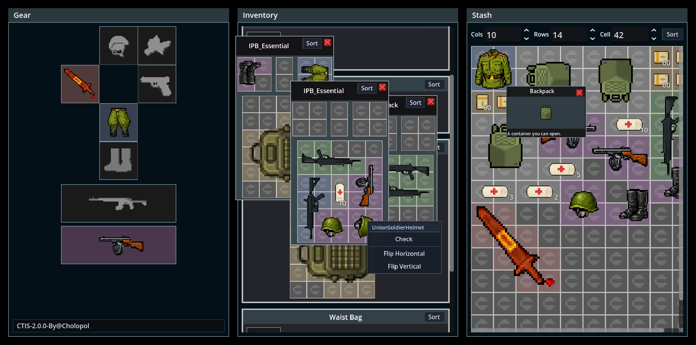

</div>

### Third-Party Dependencies

This project is built upon the following independent open-source libraries (distributed together via Release packages; source code hosted in separate GitHub repositories):

| Dependency Library | GitHub Repository | Purpose |
| ------------------ | ----------------- | ------- |
| **DotPudica Framework** | [Cholopol/dot-pudica-framework](https://github.com/Cholopol/dot-pudica-framework.git) | Compile-time source generator data binding, DI (Dependency Injection), declarative lifecycle, window management, and object pooling |
| **TetrisCoordLib** | [Cholopol/tetris-coord-lib](https://github.com/Cholopol/tetris-coord-lib.git) | Engine-agnostic pure mathematical geometry library providing Vec2I/Mat3x3/XForm2D primitive types and affine transformation calculations |

### Project Structure

| Directory | Purpose |
| --------- | ------- |
| `addons/ctis` | **CTIS Core Deliverable** (Contains Core business library, Godot view layer, and built-in visual data editor) |
| `CTIS_Demo` | **Showcase Demo Project** (Contains EFT-style UI scenes, sample art assets, JSON configs, and localization) |

### Quick Start

This repository is the CTIS core source repository (including sample showcase). In actual game development:

1. Ensure **Godot 4.7+ .NET (Mono)** edition and **.NET 8 SDK** are installed.
2. Download the plugin packages from their respective Release pages:
   - [CTIS Release](https://github.com/Cholopol/Cholopol-Tetris-Inventory-System/releases) → Extract to `addons/ctis`
   - [DotPudica Framework](https://github.com/Cholopol/dot-pudica-framework/releases) → Extract to `addons/dot-pudica`
   - [TetrisCoordLib](https://github.com/Cholopol/tetris-coord-lib/releases) → Extract to `addons/tetris_coord_lib`
3. To explore the capabilities of the dependency libraries individually, you can clone their original repositories:
   - `git clone https://github.com/Cholopol/dot-pudica-framework.git`
   - `git clone https://github.com/Cholopol/tetris-coord-lib.git`
4. In the Godot editor, open **Project -> Project Settings -> Plugins**, and enable **DotPudica**, **TetrisCoordLib**, and **CTIS** in order.
5. The plugins will automatically inject the required build configurations, dependencies, and project references into your host `.csproj`. Complete initialization following the [Quick Start: Minimal Runnable Configuration](#-quick-start-minimal-runnable-configuration) section below.

***

## 📕 Table of Contents

- [💡 Design Philosophy](#-design-philosophy)
  - [1. Why Migrate the Inventory System to Godot .NET](#1-why-migrate-the-inventory-system-to-godot-net)
  - [2. Core Advantages Over Traditional Inventory Implementations](#2-core-advantages-over-traditional-inventory-implementations)
  - [3. Why Build on DotPudica MVVM and TetrisCoordLib](#3-why-build-on-dotpudica-mvvm-and-tetriscoordlib)
- [🏗️ High-Level Overview & Layered Architecture](#️-high-level-overview--layered-architecture)
- [🧩 Deep Dive into Core Systems & Algorithms](#-deep-dive-into-core-systems--algorithms)
  - [1. Tetris Coordinate System — The Art of Affine Transformations and Coordinates](#1-tetris-coordinate-system---the-art-of-affine-transformations-and-coordinates)
  - [2. Smart Quick Exchange System — Topological Swapping and Transactional Rollback for Irregular Items](#2-smart-quick-exchange-system---topological-swapping-and-transactional-rollback-for-irregular-items)
  - [3. Accurate Irregular Shape Hit-Testing — Eliminating Transparent Bounding Box Misclicks](#3-accurate-irregular-shape-hit-testing---eliminating-transparent-bounding-box-misclicks)
  - [4. Nested Containers & Tree Caching — Flat GUID Foreign-Key Model and O(1) Retrieval](#4-nested-containers--tree-caching---flat-guid-foreign-key-model-and-o1-retrieval)
  - [5. MVVM Ghost Preview & Highlight Tile System — Zero-GC Pooled Rendering](#5-mvvm-ghost-preview--highlight-tile-system---zero-gc-pooled-rendering)
  - [6. Floating Container Windows & Context Menu — Visual Projection of Infinite Nesting](#6-floating-container-windows--context-menu---visual-projection-of-infinite-nesting)
  - [7. Inventory Auto-Organization & Advanced Features — Area-Greedy Packing and Occupancy Patches](#7-inventory-auto-organization--advanced-features---area-greedy-packing-and-occupancy-patches)
  - [8. Command-Simulation-Projection Pipeline — The Unidirectional Data-Flow Engine](#8-command-simulation-projection-pipeline---the-unidirectional-data-flow-engine)
  - [9. Save & Persistence System — Wrapper Pattern and Version Migration](#9-save--persistence-system---wrapper-pattern-and-version-migration)
  - [10. Built-in Godot Data Editor — Add Items with Just a Few Clicks](#10-built-in-godot-data-editor---add-items-with-just-a-few-clicks)
- [🚀 Quick Start: Minimal Runnable Configuration](#-quick-start-minimal-runnable-configuration)
  - [A. Environment Requirements](#a-environment-requirements)
  - [B. Host .csproj Dependency Injection](#b-host-csproj-dependency-injection)
  - [C. Service Registration and Runtime Initialization](#c-service-registration-and-runtime-initialization)
  - [D. Scene View Attachment and Binding](#d-scene-view-attachment-and-binding)
  - [E. Keybindings and Controls](#e-keybindings-and-controls)
- [🤝 Contribution Guide](#-contribution-guide)
- [📜 License & Open Source Agreements](#-license--open-source-agreements)
- [📬 Contact](#-contact)

***

## 💡 Design Philosophy

### 1. Why Migrate the Inventory System to Godot .NET

The original system was developed on the Unity Engine with a third-party reflection-based MVVM framework. **CTIS 2.0.0** has fully migrated to the Godot engine, utilizing a self-developed high-performance MVVM framework and a homogeneous affine matrix calculation library:

- **Zero Feature Loss**: All original system capabilities are retained, along with numerous new interactive features and underlying architectural adjustments.
- **AOT Friendly**: This project and its plugins fully support Native AOT compilation, with targeted optimizations for daily runtime interaction performance.
- **High Productivity of Godot 4.x + .NET 8**: Godot features a lightweight and highly modular node architecture. Combined with modern C# 12 and .NET 8's blazing-fast JIT / NativeAOT performance, it is an ideal foundation for developing heavy UI systems.
- **Free & Open Community**: As an open-source engine, Godot's greatest strength lies in open, shared technical standards and predictable commercial stability. In an era of rapidly advancing AI intelligence, Godot has increasingly become the most popular open-source engine. Its community is full of vitality, constantly attracting newcomers interested in game development as well as developers of cross-platform and automotive infotainment applications, giving Godot immense potential.

### 2. Core Advantages Over Traditional Inventory Implementations

| Comparison Dimension | Traditional Engine & Inventory Approaches | CTIS (Godot .NET 4.7+) |
| -------------------- | ----------------------------------------- | ---------------------- |
| **Architectural Layering** | Logic scattered across node scripts; UI tightly coupled with data | **Strict MVVM 3-layer decoupling**; ViewModel is a pure .NET class |
| **Data Binding** | Manual signal/event wiring; manual control iteration & refresh | **DotPudica compile-time source generator binding**; zero reflection, zero boxing, AOT friendly |
| **Error Discovery Timing** | Runtime troubleshooting (misspelled paths/signals throw null at runtime) | **Compile-time static diagnostics**; invalid binding paths cause immediate compile errors |
| **Unit Testing** | Must launch game engine and instantiate scene prefabs | **Core layer decoupled from Godot**; pure C# executes full test suites in seconds |
| **Irregular Shapes & Rotation** | Most only support simple rectangles ($W \times H$) | **Arbitrary point set (Point Set) geometric definitions**; supports 4-direction rotation and offset matrices |
| **Container Nesting** | Deep recursive object trees prone to circular references & deserialization stack overflows | **Flat GUID foreign-key indexing + `InventoryTreeCache`**; $O(1)$ relational retrieval & on-demand lazy loading |
| **Interaction Accuracy** | Rectangular bounding boxes block clicks; frequent misclicks on transparent blank borders | **`ShapeHitTest` irregular shape filtering**; only reacts to occupied tile areas, precisely penetrating blank spaces |
| **Lifecycle Management** | Manual `Instantiate` / `Destroy` of GameObjects | **Declarative lifecycle**; auto-binding on entering tree, auto-recycle & unsubscription on exiting tree |

### 3. Why Build on DotPudica MVVM and TetrisCoordLib

1. **`TetrisCoordLib`** ([GitHub](https://github.com/Cholopol/tetris-coord-lib.git)): Abstracts rotations, translations, coordinate space transformations, and geometric occupancy calculations into a pure mathematical library with zero dependency on higher-level UI or engine APIs.
2. **`DotPudica Framework`** ([GitHub](https://github.com/Cholopol/dot-pudica-framework.git)): Leverages C# Roslyn Source Generators to statically generate strongly-typed delegate binding code at compile time, eliminating runtime reflection entirely; provides out-of-the-box Dependency Injection (DI), UI thread dispatcher, window stack management, and object pooling.
3. **Single Source of Truth**: UI is always the geometric projection of ViewModel state on screen, eliminating the possibility of multi-copy state desynchronization.
4. The framework provides comprehensive declarative lifecycle management and full object pooling. Instead of pre-instantiating ViewModels or Views for all items and sub-containers, it loads them on demand and recycles them for reuse as soon as the view window closes.

***

## 🏗️ High-Level Overview & Layered Architecture

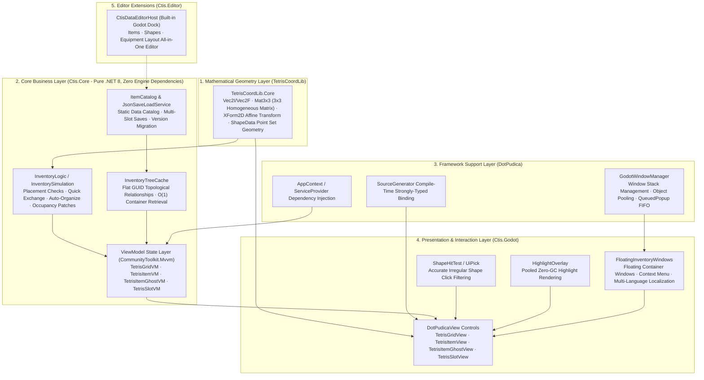

***

## 🧩 Deep Dive into Core Systems & Algorithms

<a id="tetris-coordinate-system"></a>

### 1. Tetris Coordinate System — The Art of Affine Transformations and Coordinates

The grid container discretizes continuous UI pixel space into a 2D integer matrix. All collision checks, rotations, and alignments are computed based on a strict Cartesian coordinate system.

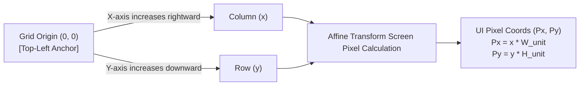

#### 1. Pixel Position Mapping Formula

Let the unit grid pixel dimensions be $W_{unit}, H_{unit}$, and the item's logical origin in the grid be $(x, y)$. The affine transformation formula mapping to Godot UI local coordinates $(P_x, P_y)$ is:

$$
P_x = x \times W_{unit}
$$

$$
P_y = y \times H_{unit}
$$

> [!NOTE]
> In Godot's Control coordinate system, the positive Y-axis points downward, which perfectly aligns with the logical grid coordinate system. No sign negation is needed, resulting in natural and efficient calculations.

#### 2. Shape Definition and 4-Direction Rotation Matrix Algorithm

An item's footprint is not a fixed texture bounding box, but a discrete point set relative to origin $(0,0)$: $\mathcal{S} = \{ (p_{x1}, p_{y1}), (p_{x2}, p_{y2}), \dots, (p_{xn}, p_{yn}) \}$.

The 2D linear transformation matrix for a $90^\circ$ clockwise rotation is:

$$
\begin{bmatrix} x' \\ y' \end{bmatrix} = \begin{bmatrix} 0 & -1 \\ 1 & 0 \end{bmatrix} \begin{bmatrix} x \\ y \end{bmatrix} = \begin{bmatrix} -y \\ x \end{bmatrix}
$$

```csharp
// TetrisCoordLib.Core / Pure mathematical rotation algorithm
public static Vec2I RotateClockwise(Vec2I point) => new(-point.Y, point.X);
public static Vec2I RotateCounterClockwise(Vec2I point) => new(point.Y, -point.X);
```

#### 3. Rotation Offset Correction

Since rotating around the $(0,0)$ pivot causes negative coordinate overflow, the system computes the geometric bounding box and introduces a `RotationOffset` correction vector to ensure that rotated items remain tightly aligned to the grid:

$$
Target(x, y) = (Origin_x + p_x + Offset_x,\ Origin_y + p_y + Offset_y)
$$

***

<a id="quick-exchange-system"></a>

### 2. Smart Quick Exchange System — Topological Swapping and Transactional Rollback for Irregular Items

Quick Exchange allows players to drag and drop an item over an occupied area. If specific geometric coverage conditions are met, the system automatically "squeezes out" the overlapped irregular items and places them precisely into the space vacated by the originally dragged item, completing a single-step swap.

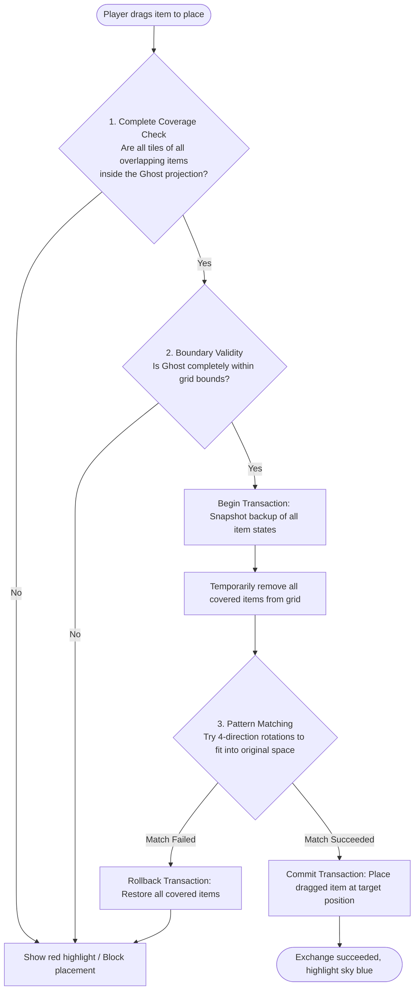

#### Core Decision & Mapping Principles

1. **Complete Coverage Principle**: The Ghost coverage set $C_{ghost}$ must completely contain the occupied point set $C_{item}$ of all overlapping items:

$$
\forall Item \in Overlap, \quad C_{item} \subseteq C_{ghost}
$$

2. **4-Direction Pattern Matching**:
   For the displaced items, the system iterates over their four orientations $dir \in \{0^\circ, 90^\circ, 180^\circ, 270^\circ\}$, picks a reference point $T_0$ from the source release area, deduces the valid anchor point, and verifies exact point set coincidence:

$$
Anchor = T_0 - P_{ref} - Offset_{rotated}
$$

3. **Transactional Consistency Guarantee**: The entire exchange process possesses ACID atomicity — if any covered item fails to find a valid fitting anchor in the source space, a full rollback occurs immediately, leaving zero dirty state.

***

<a id="sprite-mesh-raycast-filter"></a>

### 3. Accurate Irregular Shape Hit-Testing — Eliminating Transparent Bounding Box Misclicks

In game UI rendering, all control bounding boxes are **rectangular** by default. For irregular items such as "L"-shaped, "T"-shaped, or diagonal rifles, standard rectangular hit-testing causes transparent empty corners to intercept mouse events, severely degrading the tactile experience of dense inventory management.

#### Decision Pipeline (`ShapeHitTest.cs` & `UiPick.cs`)

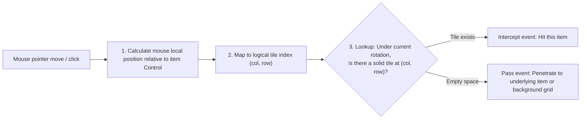

- **User Experience Benefits**: When multiple complex irregular weapons are packed side-by-side, hover and click events accurately correspond to visual shapes with zero dead zones.
- **Performance Optimization**: Point sets under rotation are cached locally (`_cachedOccupiedPoints`), making matrix queries $O(1)$ with zero GC pressure during dragging.

***

<a id="nested-inventory-guid"></a>

### 4. Nested Containers & Tree Caching — Flat GUID Foreign-Key Model and O(1) Retrieval

In Tarkov-like games, multi-layer nesting (e.g., "backpack contains a tactical rig, rig contains magazines, magazine pouch contains ammo") is an extremely common mechanic. Traditional implementations directly using nested object trees (`class Bag { List<Item> Items; }`) easily lead to recursive deadlocks, overly deep serialization hierarchies, and heavy memory overhead.

CTIS introduces a design combining **flat storage + `InventoryTreeCache` topological cache** similar to relational databases:

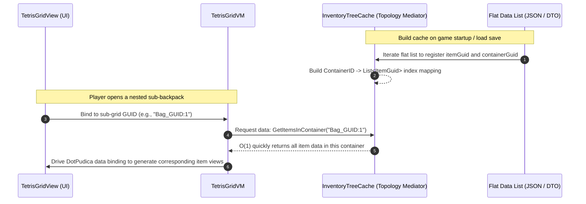

#### Comparison: Traditional Tree vs CTIS Topology Mediator

| Feature | Traditional Nested Object Tree | CTIS Flat GUID + Topology Cache |
| ------- | ------------------------------ | -------------------------------- |
| **Memory Structure** | Deep recursive object references | Flat data list + GUID foreign-key references |
| **Container Lookup** | $O(N)$ recursive DFS traversal of entire tree | **$O(1)$ dictionary hash lookup** |
| **Data Safety** | Mutual nesting can cause circular reference deadlocks | **Floyd's Cycle-Finding algorithm with $O(1)$ space detects self-containment**, preventing circular references before placement |
| **UI View Lifecycle** | Destroying objects when closing UI risks data loss | **Complete decoupling of UI and data**: closing panel only recycles View nodes; data remains intact in Cache |
| **Lazy Loading** | Startup requires full deserialization to instantiate objects | **On-demand loading**: child nodes fetched from Cache only when a specific backpack is opened |

#### High-Performance Bitboard Occupancy Detection (`OccupancyBoard`)

Every container node (including the main backpack and nested containers at arbitrary depths) mounts an `OccupancyBoard` instance, adopting a **Bitboard-inspired concept** from chess engines for $O(1)$ collision detection:

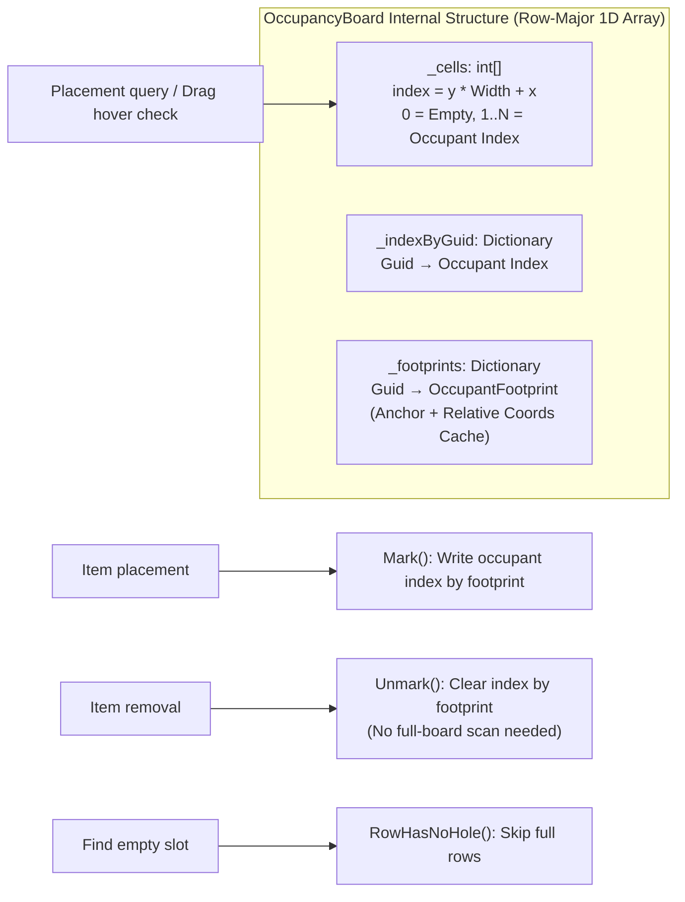

**Core Performance Optimizations:**

1. **Row-Major 1D Array Storage**: Grid occupancy information is stored in contiguous memory in an `int[]`, indexed directly by `index = y * Width + x`. Single-cell queries are $O(1)$ with exceptional CPU cache hit rates.
2. **Full-Row Skip Optimization**: `TryFindFreeOrigin` searches for empty slots by first calling `RowHasNoHole` to check if a row is completely filled, skipping the entire row scan immediately — significantly improving performance under high occupancy.
3. **Zero-Allocation Coverage Scan**: The `ScanCoverage` method counts unique occupants in the overlap area using only two local variable counters (0 = empty, 1 = single item eligible for exchange/stack, $\ge 2$ = multiple items conflict), achieving **zero GC allocation per frame during drag-and-drop hovering**.
4. **Footprint Cache Incremental Updates**: The occupied point set of each item is cached as an `OccupantFootprint`. When removing or moving an item, its corresponding cells are cleared directly based on its footprint without scanning the entire board.
5. **Unified Nesting Model**: Whether it is the main inventory or a sub-grid embedded in an item (ContainerId formatted as `{itemGuid}:{index}`), the same `OccupancyBoard` structure and detection logic are used. Nesting depth has zero impact on detection performance.

#### Zero-Allocation Circular Dependency Detection — Floyd's Cycle-Finding Algorithm

Nested inventory systems must prevent players from placing an item into its own child container (e.g., placing Backpack A into Small Bag B inside Backpack A, then placing Small Bag B back into Backpack A, creating an infinite loop). `InventoryTreeCache.IsDescendantContainer` combines a **string prefix fast path + Floyd's Tortoise and Hare cycle detection algorithm**, achieving $O(1)$ space complexity and zero GC allocations during drag checks:

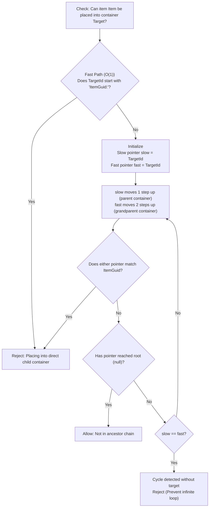

**Algorithm Characteristics:**

1. **Prefix Fast Path**: Container IDs follow the `{ParentItemGuid}:{GridIndex}` naming convention (e.g., `BagA_Guid:0` represents the 0th embedded grid of Backpack A). String prefix matching allows $O(1)$ detection of direct child containers without traversal.
2. **Floyd's Tortoise and Hare**: For deeper nesting, two pointers are maintained:
   - **Slow pointer (Tortoise)**: Traces up 1 parent container level per step.
   - **Fast pointer (Hare)**: Traces up 2 parent container levels per step.
   - Each step verifies whether the owner of the current container matches the target item.
3. **Inherent Cycle Detection**: If the fast and slow pointers meet (`slow == fast`), a cycle exists in the container tree that does not contain the target item; it terminates and rejects immediately to prevent infinite recursion.
4. **Zero Heap Allocations**: The entire detection process uses only a few string local variables without `HashSet`/`Stack` visitor collections, causing zero GC pressure on high-frequency drag hover calls.
5. **Arbitrary Depth Support**: Correctly handles arbitrary nesting depths: Backpack → Tactical Rig → Magazine Pouch → Ammo Case → ...

***

<a id="highlight-system"></a>

### 5. MVVM Ghost Preview & Highlight Tile System — Zero-GC Pooled Rendering

The system uses `TetrisItemGhostVM` (ghost item) to simulate dragging and hover placement. Real inventory data remains unmodified until the player releases the mouse button.

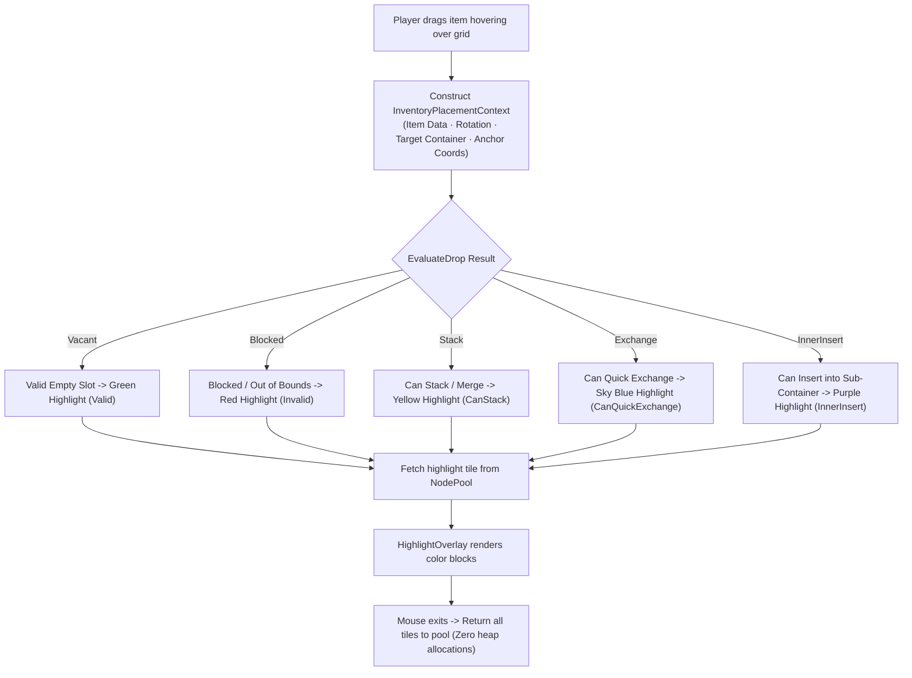

- **Data-Driven Configuration**: All highlight colors and alpha transparency values are centrally configured in `PlacementConfig.json`, supporting runtime switching for color-blind accessibility modes.
- **Object Pooling Technology**: Powered by `NodePool`, highlight tile nodes are recycled and reused, maintaining smooth and stable frame rates during high-frequency dragging and rotation.

***

<a id="floating-window-system"></a>

### 6. Floating Container Windows & Context Menu — Visual Projection of Infinite Nesting

When players right-click container equipment (such as tactical vests, backpacks, medical cases) in their inventory, the system dynamically opens a draggable floating grid window (`FloatingGridWindow`).

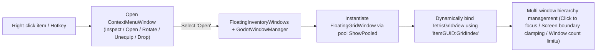

- **Multi-Window Lifecycle**: Supports opening multiple nested windows at different levels concurrently, automatically managing Z-index focus layers and screen boundary clamping.
- **Dynamic GUID Binding**: Grid components within floating windows use the exact same `TetrisGridView` as the main inventory, reusing all interaction logic simply by binding different GUIDs.

***

<a id="organize-system"></a>

### 7. Inventory Auto-Organization & Advanced Features — Area-Greedy Packing and Occupancy Patches

#### 1. One-Click Auto-Organization (Auto Organization)

Supports auto-organizing within a single grid, a specified container, or globally via `TryOrganizeGrid`. Built-in **Area-First** and weighted greedy bin packing algorithm:

1. Extract all items in the current container and sort them descending by occupied area.
2. Attempt placement in standard orientation first; if it does not fit, try a $90^\circ$ clockwise rotation.
3. Search from top-left to bottom-right for the first valid anchor point, arranging items compactly in one click.

#### 2. Dynamic Occupancy Patches (Occupancy Patch)

Supports dynamic footprint modifications when customizing weapon attachments (e.g., adding an extended magazine or suppressor dynamically expands the item's occupied point set in the grid; removing the attachment immediately shrinks it back). Synchronized to the data tree via `ApplyOccupancyPatch`.

#### 3. Command & Network Replay Support (Command & Replay)

All core operations are encapsulated as immutable `InventoryCommand` objects (carrying `CommandId` idempotency deduplication and `ExpectedRevision` optimistic-concurrency validation), natively supporting multiplayer network replication, replay, and Undo/Redo. See [Command-Simulation-Projection Pipeline](#command-pipeline) for the full pipeline design.

***

<a id="command-pipeline"></a>

### 8. Command-Simulation-Projection Pipeline — The Unidirectional Data-Flow Engine

Every inventory state mutation — placing, exchanging, stacking, splitting, flipping, organizing, occupancy patches, container resizing — flows through the same pipeline: **intent is wrapped in an immutable command, the simulation layer validates and commits it to the tree as a pure function, and the projection layer then precisely flushes the successful result back into the ViewModels**. Views and ViewModels never mutate data directly; `InventoryTreeCache` is the single source of truth.

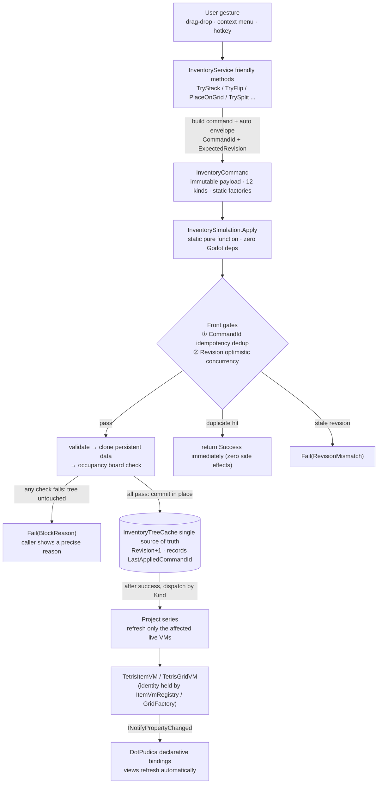

#### 1. Command Wrapping: Intent as Data

- **Immutable**: all `InventoryCommand` properties are `init`-only — commands are naturally serializable, cacheable, and replayable
- **Static factories prevent misuse**: each of the 12 `InventoryCommandKind` values has a dedicated factory (`InventoryCommand.Place(...)` / `.Flip(...)` / `.Stack(...)` ...); required arguments are enforced at the signature level, so a "half-filled command" cannot exist
- **Envelope separation**: `WithEnvelope(commandId, expectedRevision)` attaches the replay envelope; local commands get it automatically via `InventoryService.Apply`, while remote commands must carry one and are strictly validated by `ApplyRemote`
- **Guids issued by an authority**: new item identities come from `IItemIdFactory`, whose contract explicitly states "authority-owned in a networked session" — reserved for multiplayer synchronization

```csharp
// Service friendly method: intent → command → simulation → projection, in one line
public bool TryStack(TetrisItemVM source, TetrisItemVM target)
    => Apply(InventoryCommand.Stack(source.Guid, target.Guid)).Ok;
```

#### 2. Simulation: A Pure-Function Transaction of Clone-Validate-Commit

`InventorySimulation.Apply` is a static pure function (in `Ctis.Core`, zero engine dependencies), and every command handler follows the same pattern:

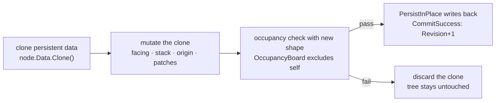

- **Zero trace on failure**: validation and mutation happen entirely on cloned copies; results are written back to the tree only after the occupancy check passes — rejected commands leave no intermediate state
- **Deferred batch commits**: multi-item commands such as `Exchange` stage every occupant's clone into a write list and flush once after the whole plan validates
- **Uniform tracing**: every handler opens a `CtisTrace.Scope` profiling span
- **Two front gates**:
  1. *Idempotency dedup*: `CommandId == LastAppliedCommandId` → return Success immediately; safe against duplicate network delivery
  2. *Optimistic concurrency*: `ExpectedRevision != Revision` → `RevisionMismatch`; stale commands are rejected so old commands can never overwrite newer state

#### 3. Projection: After Success, Precisely Flushed Back

`Dispatch` records the item's previous container before simulation, and after a **successful** commit dispatches by Kind into minimal ViewModel updates. VMs are downstream projection caches of the tree, not a second copy of state:

| Command | Simulation validation highlights (excerpt) | Projection after success |
|---|---|---|
| `Place` | container/item/catalog exist · self-nesting forbidden · occupancy check | `ProjectFrom` + `MoveVmOntoGrid` |
| `MoveToSlot` | slot exists · type match · slot vacant | `DetachVmOccupancy`; slot VM bound by the `PlaceOnSlot` wrapper |
| `Lift` | item exists | `DetachVmOccupancy` (clears the old container; item moves into the held container) |
| `Stack` | stackable · capacity limit (overflow stays in source) | both `CurrentStack` refreshed; swallowed source removes its view and `Unregister`s |
| `Split` | valid amount · new guid conflict-free · adjacent/free origin search | `GetOrCreate` a new VM and place it on the grid |
| `ResizeContainer` | size clamping · rejects wholesale if repack fails | `RefreshFromTree` (whole grid repack) |
| `Exchange` | exchange plan must seat all affected items legally | target grid + origin grid each `RefreshFromTree` |
| `Flip` / `PatchOccupancy` / `RemoveOccupancyPatch` | in-place occupancy check (neighbor collision rejects) | `ProjectItemShape`: remove with `destroyView:false` → re-project → replace in position (zero view destruction) |
| `OrganizeContainer` / `OrganizeItemGrids` | container exists · sort strategy | `RefreshFromTree` (the latter walks all inner grids by `guid:` prefix) |

Three key details:

- **Unified shape-change pipeline**: `Flip` and occupancy patches share `ProjectItemShape` — remove from the grid with `destroyView:false` (both view and VM survive), recompute derived state via `ProjectFrom`, then place back in position. Any future "mutable footprint" feature (shrink-on-damage, mod expansion) plugs into the same pipeline and inherits validation, rollback, and persistence for free
- **Lazy materialization**: `EnsureSpawned` / `TryEnsureContainer` before `PlaceOnGrid` support VM-first creation orders — e.g. the debug panel's `GetOrCreate` produces a VM before any tree data exists, and `EnsureSpawned` then materializes it into a persistent tree node; a grid VM without a tree node gets one via a `ResizeContainer` command on demand. The command layer therefore always finds its target in the tree
- **One-way read path**: coordinates, width/height, and occupancy point sets on VMs are all derived from `(Occupancy, Patches, Direction, FlipH, FlipV)`; user gestures always travel "command → simulation → tree → projection" — there is no side channel where VMs mutate data directly

#### 4. Why This Design

- **Replayable**: immutable commands + `CommandId` idempotency + `Revision` optimistic concurrency → the same command sequence replayed on the same initial tree yields the same final state. This is the common foundation for multiplayer sync, reconnection, replay recording, and Undo/Redo
- **Testable**: the simulation layer is pure functions over pure data (tree + catalog + equipment layout) — no Godot, no windows; deterministic unit tests construct data directly
- **Zero ghost state**: the UI is only a projection; "what's in the backpack" has exactly one authoritative answer (the tree). Close every window and reopen — everything restores from the tree
- **Explainable failures**: rejected commands carry a typed `InventoryPlacementBlockReason` (`SlotTypeMismatch` / `SlotOccupied` / `SelfOwnedContainer` / `RevisionMismatch` ...), so callers can surface precise UI hints

***

<a id="save-load-system"></a>

### 9. Save & Persistence System — Wrapper Pattern and Version Migration

`JsonSaveLoadService` provides a decoupled data persistence solution:

```mermaid
flowchart LR
  RuntimeState["Runtime Memory State<br/>(ItemVMRegistry & TreeCache)"] -->|Serialize| DTO["Flat Payload<br/>(Items list + GridConfigs)"]
  DTO --> Wrap["Wrapper Envelope<br/>(Version · Timestamp · CatalogVersion)"]
  Wrap --> SaveFile[("user://ctis_save_{index}.json<br/>3 fixed save slots")]

  SaveFile -->|Deserialize| Check{"Validate CatalogVersion"}
  Check -->|"incompatible"| Abort["Return immediately<br/>live state left untouched"]
  Check -->|"compatible"| Clear["Clear Registry and TreeCache"]
  Clear --> Apply["Restore GridConfigs first<br/>then PlaceItem one by one"]
  Apply --> Notify["Trigger Restored event"]
  Notify --> VM["ViewModel calls RebuildFromCache<br/>to reconstruct item collection from TreeCache"]
  VM --> View["DotPudica data binding<br/>automatically refreshes View layer"]
```

#### 1. Save File Structure: Three JSON Layers

```json
{
  "Version": 1,                          // SaveFileWrapper: save-format version (structural migration)
  "Timestamp": "2026/08/23 12:00:00",
  "Payload": {
    "CatalogVersion": 1,                 // GameSaveData: item-catalog version (compatibility check)
    "Items": [                           // TetrisItemPersistentData list (one entry per item)
      {
        "ItemId": 7, "ItemGuid": "a1b2...", "ContainerId": "depository",
        "OriginPosition": { "X": 3, "Y": 5 }, "Direction": 2,
        "Stack": 12, "IsOnSlot": false, "SlotIndex": -1,
        "CustomData": { }, "OccupancyPatches": [ ... ]
      }
    ],
    "GridConfigs": {                     // grid size configs (container id → size)
      "depository": { "Width": 12, "Height": 8 }
    }
  }
}
```

Each item entry records only its **persistent truth**: identity (`ItemId`/`ItemGuid`), placement (`ContainerId`/`OriginPosition`/`Direction`/`FlipH`/`FlipV`), stack (`Stack`), slot (`IsOnSlot`/`SlotIndex`), extensions (`CustomData`/`OccupancyPatches`). Derived state — shape point sets, bounding-box sizes — **is never saved**; it is re-derived at load time by `ItemShape.Resolve` from `(Occupancy, Patches, Direction, Flip)`, keeping saves naturally decoupled from geometry-algorithm evolution. Fields at default values (false/0) are omitted to keep files lean.

#### 2. Storage Logic

- **Serialization filters**: walks every container in the tree, skipping empty `Held` (in-transit) containers; `GridConfigs` records only "non-slot/non-held grids that hold items, plus the Depository" — slot and held sizes are layout-time constants that need no persistence
- **Restore order**: version-compatible → clear Registry and TreeCache → restore `GridConfigs` **first**, **then** `PlaceItem` each entry (container sizes are in place before items land) → raise `Restored`
- **Dual version numbers**: `Version` (save-format structure, reserved for migration) and `CatalogVersion` (item catalog, validating static-data compatibility) serve distinct purposes; an incompatible save is **rejected without clearing the current live state**, ruling out half-migrated corrupted data
- **Slot abstraction**: the `ISaveSlotStore` interface isolates environments — Core ships `InMemorySaveSlotStore` (pure memory, for tests), Godot ships `GodotSaveSlotStore` persisting to `user://ctis_save_{index}.json` (3 fixed slots); `SaveSlotInfo` reads metadata only (`HasData`/`IsCorrupt`/`Timestamp`) without touching live state, and `LoadSlot` uniformly returns false for the three failure modes: missing slot / corrupt JSON / catalog mismatch
- **Serialization options**: `WriteIndented` for human readability + custom `Vec2I`/`Dir` converters + a Source Generator context (`CtisJsonContext`), AOT/trimming friendly

***

<a id="item-editor"></a>

### 10. Built-in Godot Data Editor — Add Items with Just a Few Clicks

CTIS integrates a full-featured visual data workbench directly inside the Godot editor (**Project Menu -> Tools -> CTIS/Data Editor**):

<div align="center">

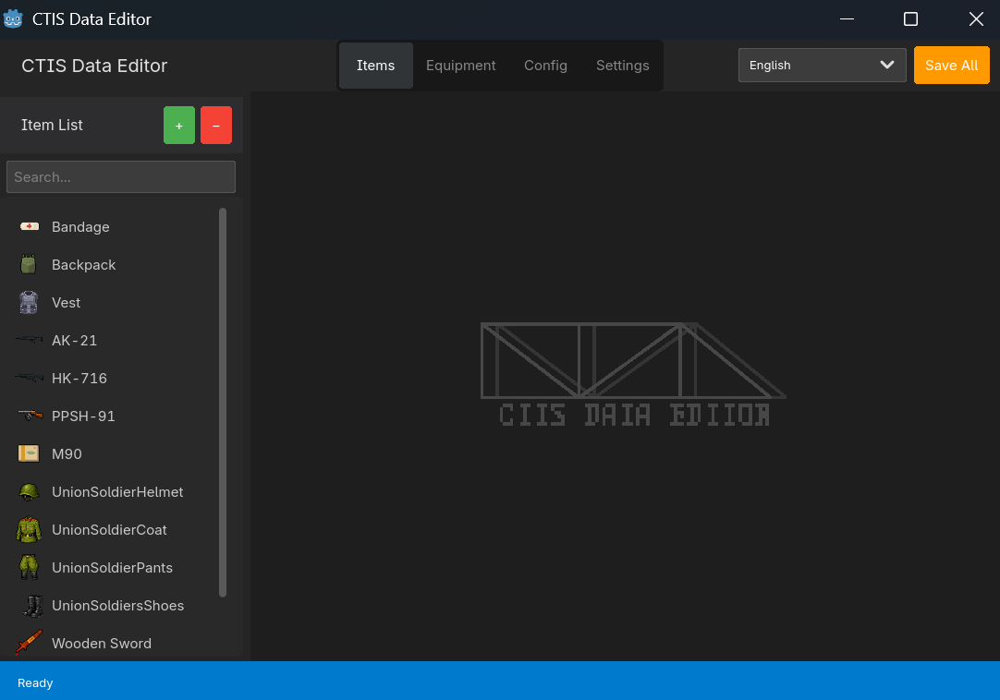

</div>

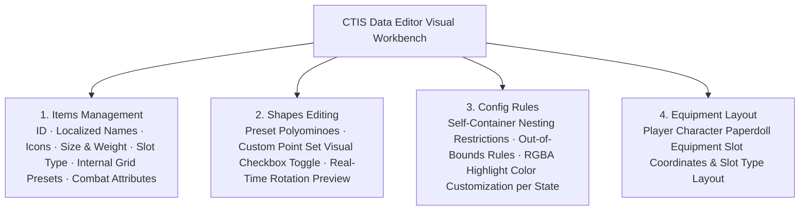

- **Two-Way Data Synchronization**: Saving in the editor directly updates `ItemCatalog.json`, `PlacementConfig.json`, and `EquipmentLayout.json`, taking effect immediately without restarting the editor.
- **Convenient Localization Autofill**: Supports one-click propagation of current names and descriptions across all localization language entries.

***

## 🚀 Quick Start: Minimal Runnable Configuration

### A. Environment Requirements

| Dependency | Minimum Requirement | Notes |
| ---------- | ------------------- | ----- |
| **Godot Engine** | **4.7.x .NET** (Mono) | Godot 4.7 engine with C# support required |
| **.NET SDK** | **.NET 8.0** SDK | C# 12 compiler environment recommended |
| **DotPudica Framework** | Distributed with Release package | [GitHub Repository](https://github.com/Cholopol/dot-pudica-framework.git), MVVM framework and source generator |
| **TetrisCoordLib** | Distributed with Release package | [GitHub Repository](https://github.com/Cholopol/tetris-coord-lib.git), mathematical geometry coordinate library |

### B. Host `.csproj` Dependency Injection

When the **CTIS** plugin is enabled in the Godot editor, `plugin.gd` will automatically inject and maintain the following configuration block in your game project's `.csproj` (**no manual editing required**):

```xml
<!-- Ctis:Begin -->
  <ItemGroup>
    <Compile Remove="addons/ctis/**/*.cs" />
  </ItemGroup>
  <ItemGroup>
    <Compile Include="addons/ctis/editor/CtisDataEditorHost.cs" />
  </ItemGroup>
  <ItemGroup>
    <ProjectReference Include="addons/ctis/Core/Ctis.Core.csproj" />
    <ProjectReference Include="addons/ctis/Godot/Ctis.Godot.csproj" />
  </ItemGroup>
<!-- Ctis:End -->
```

### C. Service Registration and Runtime Initialization

Configure DI (Dependency Injection) services and load data in the global entry point of your game (e.g. `Main.cs` or scene root node). The example below is excerpted from the demo's [GameBootstrap.cs](file:///d:/File/_UnityFile/Cholopol-Tetris-Inventory-System/CTIS_Demo/demo/_Scripts/GameBootstrap.cs). Note that the `IFloatingInventoryWindows` / `IInventorySession` interfaces are provided by the plugin, but `FloatingInventoryWindows` / `InventorySession` and the window types are **demo-side implementations** (located in `CTIS_Demo/demo/_Scripts/`, not distributed with the plugin) — when integrating into your own project, implement these two interfaces yourself (or copy from the demo) and substitute your own window types and scene paths:

```csharp
using Godot;
using Ctis.Core;
using Ctis.Presentation;
using DotPudica.Godot.Views;
using Microsoft.Extensions.DependencyInjection;
using AppContext = DotPudica.Godot.AppContext;  // Alias: avoids ambiguity with System.AppContext

public partial class GameBootstrap : Node
{
    private AppContext? _app;

    public override void _Ready()
    {
        // 1. Initialize Window Manager
        var wm = GetNodeOrNull<GodotWindowManager>("WindowManager")
            ?? new GodotWindowManager { Name = "WindowManager" };
        if (wm.GetParent() == null)
            AddChild(wm);

        // 2. Initialize AppContext and register services
        _app = new AppContext().Initialize(services =>
        {
            services.AddCtis();           // Register CTIS core business services
            services.AddCtisGodot();      // Register CTIS Godot presentation & interaction services
            services.AddSingleton<IFloatingInventoryWindows, FloatingInventoryWindows>();  // demo implementation
            services.AddSingleton<IInventorySession, InventorySession>();                  // demo implementation
        }, wm);

        // 3. Load item catalog and configuration tables
        ItemCatalogLoader.LoadInto(_app.Services.GetRequiredService<IItemCatalog>());
        PlacementConfigLoader.LoadInto(_app.Services.GetRequiredService<PlacementConfig>());
        EquipmentLayoutLoader.LoadInto(_app.Services.GetRequiredService<EquipmentLayout>());

        // 4. Attach the CTIS runtime (window/ghost layers; re-parents wm under CtisWindowLayer)
        CtisRuntime.Attach(this, wm);

        // 5. Configure window object pools (scene path + pool size); must be called before ShowPooled
        wm.ConfigurePool<InventoryWindow>("res://CTIS_Demo/demo/InventoryWindow.tscn", 1);
        wm.ConfigurePool<FloatingGridWindow>("res://CTIS_Demo/demo/FloatingGridWindow.tscn", 8);
        wm.ConfigurePool<ContextMenuWindow>("res://CTIS_Demo/demo/ContextMenuWindow.tscn", 2);
    }

    public override void _ExitTree()
    {
        // AppContext can only be initialized once until Dispose; release it when the scene exits
        _app?.Dispose();
        _app = null;
    }
}
```

### D. Scene View Attachment and Binding

Views fall into two categories: **host views** (which declare their own `[DotPudicaView]` bound to some VM) and **built-in pooled controls** (`TetrisGridView` / `TetrisItemView`, etc., which already carry `[DotPudicaView(..., AutoInitialize = false, Pooled = true)]` with a full lifecycle — **do not derive from them and re-apply the attribute**, or the source generator will emit conflicting lifecycle members along the inheritance chain). Host views obtain built-in controls from the pool via `CtisRuntime.CreateGridView()` and activate them with `BindGrid(vm)`:

```csharp
using Godot;
using Ctis.Core;
using Ctis.Presentation;
using DotPudica.Core.ViewModels;
using DotPudica.Godot.Views;

// Host view: declares its own VM, binds an external VM via ActivateViewModel (see the demo's ContainerPanelView)
[DotPudicaView(typeof(ContainerPanelVM), AutoInitialize = false, Pooled = true, Ownership = ViewModelOwnership.External)]
public partial class PlayerBackpackView : VBoxContainer
{
    public override void _Ready() => InitializeView();
    public override void _ExitTree() => RecycleView();  // Pooled view recycling: unbind without destroying the node

    public void BindPanel(ContainerPanelVM vm) => ActivateViewModel(vm);

    partial void OnViewModelBound()
    {
        // Take a built-in TetrisGridView from the pool and bind the grid VM of ContainerPanelVM
        var gridVm = ViewModel!.GetOrCreatePersistentGrid(0, width: 8, height: 6);
        var gridView = CtisRuntime.CreateGridView();
        AddChild(gridView);
        gridView.BindGrid(gridVm);
    }
}

// Pooled window (e.g. the demo's FloatingGridWindow): the window itself is also a host view
[DotPudicaView(typeof(FloatingGridVM), Pooled = true)]
public partial class FloatingGridWindow : GodotWindow
{
    public override void _Ready() => InitializeView();

    public override void _ExitTree()
    {
        RecycleView();  // Object pool reuse: unbind without destroying the node
        base._ExitTree();
    }
}
```

### E. Keybindings and Controls

| Action / Key | Triggered Action | Description |
| ------------ | ---------------- | ----------- |
| **Left Mouse Drag** | Pick up / Move item | Activates `TetrisItemGhostVM` and enters placement preview state |
| **R Key** | Rotate item $90^\circ$ clockwise | Dynamically transforms point set and recalculates `RotationOffset` & highlight state |
| **Right Mouse Click** | Open context menu | Quick access to inspect attributes, rotate, unequip, drop, open sub-containers, etc. |
| **B Key** | Open / Close main inventory panel | Toggles inventory UI visibility, triggering view enter/exit tree lifecycles |
| **F1 Key** | Open / Close debug item panel | Real-time testing of item spawning |

***

## 🤝 Contribution Guide

Issues and Pull Requests are warmly welcomed! Please adhere to the following guidelines:

- **Code Standards**: Follow official C# coding conventions; use `PascalCase` for types and public members, `camelCase` for local variables, and include standard XML documentation comments on core interfaces.
- **Architectural Conventions**: Maintain **zero dependencies** on the Godot engine in `Ctis.Core` and `TetrisCoordLib.Core`; all engine-specific code must be encapsulated within `Ctis.Godot` and `TetrisCoordLib.Godot`.
- **Test Verification**: Currently, custom test scripts should be written for validation.

***

## 📜 License & Open Source Agreements

- This project is open-sourced under the **Apache License 2.0**. For details, please refer to the [LICENSE](LICENSE) file.
- Derivative projects or commercial products must include the [NOTICE.txt](NOTICE.txt) attribution file.
- In accordance with Apache 2.0 **Section 4(b)**, source code copyright notices used in commercial projects must not be removed; if modifications are made to the source code, prominent notices stating who made the changes and the date of change must be added to the file header:

```csharp
// Modified by [Your Name] [Year]:
// [Brief description of changes]
```

> [!WARNING]
> **Using this project for plagiarism, unauthorized reposting, piracy, reselling, or any acts infringing upon open-source rights is strictly prohibited. The open-source spirit relies on mutual respect and protection; community members are welcome to report any infringement directly to the author.**

***

## 📬 Contact

If you encounter any issues during integration or usage, or have ideas for in-depth discussion, feel free to reach out via:

- 📧 **Email**: `cholopol@163.com`
- 📺 **Bilibili**: [鹿卜Cholopol](https://space.bilibili.com/88797367)
- 💬 **GitHub Issues**: [Submit Feedback & Issues](https://github.com/Cholopol/Cholopol-Tetris-Inventory-System/issues)
