# Cholopol's Tetris Inventory System

<div align="center">


</div>

      [](https://space.bilibili.com/88797367) [](https://github.com/Cholopol/Cholopol-Tetris-Inventory-System/stargazers) [](https://github.com/Cholopol/Cholopol-Tetris-Inventory-System/network/members)

[English](README.md) | 简体中文

**CTIS (Cholopol Tetris Inventory System)** 是面向 **Godot 4.7+ 与 .NET 8** 构建的高级网格背包管理系统。系统基于 **DotPudica MVVM** 框架与 **TetrisCoordLib** 纯数学几何库开发，实现了数据逻辑与 UI 表现的彻底解耦。完美还原了《逃离塔科夫》（Escape from Tarkov）的核心交互体验，支持异形物品、无限背包嵌套、智能快捷交换、精确异形点击过滤、浮动容器窗口、背包一键整理以及多槽位数据持久化。

<div align="center">


</div>

### 第三方依赖

本项目基于以下独立开源库构建（访问仓库通过 Release 包一并分发，源码托管于独立 GitHub 仓库）：

| 依赖库                     | GitHub 仓库                                                                             | 用途                                                |
| ----------------------- | ------------------------------------------------------------------------------------- | ------------------------------------------------- |
| **DotPudica Framework** | [Cholopol/dot-pudica-framework](https://github.com/Cholopol/dot-pudica-framework.git) | 编译期源生成器数据绑定、DI 依赖注入、声明式生命周期、窗口管理与对象池              |
| **TetrisCoordLib**      | [Cholopol/tetris-coord-lib](https://github.com/Cholopol/tetris-coord-lib.git)         | 无引擎依赖的纯数学几何库，提供 Vec2I/Mat3x3/XForm2D 等基础类型与仿射变换运算 |

### 项目结构

| 目录            | 用途                                                   |
| ------------- | ---------------------------------------------------- |
| `addons/ctis` | **CTIS 核心交付物**（包含 Core 业务库、Godot 视图层及内置可视化数据编辑器）     |
| `CTIS_Demo`   | **Showcase 演示工程**（含 EFT 风格 UI 场景、示例美术资源、JSON 配置与多语言） |

### 快速开始

本仓库为 CTIS 核心源码仓（含样例演示）。在实际游戏开发中：

1. 确保安装了 **Godot 4.7+ .NET (Mono)** 版与 **.NET 8 SDK**。
2. 从各仓库 Release 页面分别下载插件包：
   - [CTIS 发布包](https://github.com/Cholopol/Cholopol-Tetris-Inventory-System/releases) → 解压至 `addons/ctis`
   - [DotPudica Framework](https://github.com/Cholopol/dot-pudica-framework/releases) → 解压至 `addons/dot-pudica`
   - [TetrisCoordLib](https://github.com/Cholopol/tetris-coord-lib/releases) → 解压至 `addons/tetris_coord_lib`
3. 如需分别了解依赖库能力可以克隆原始仓库：
   - `git clone https://github.com/Cholopol/dot-pudica-framework.git`
   - `git clone https://github.com/Cholopol/tetris-coord-lib.git`
4. 在 Godot 编辑器中打开 **项目 -> 项目设置 -> 插件**，依次启用 **DotPudica**、**TetrisCoordLib** 与 **CTIS**。
5. 插件将自动在你的宿主 `.csproj` 中注入所需的编译配置、依赖包与项目引用，按下方「[快速使用](#快速使用最小可运行配置)」完成初始化即可。

***

## 📕 目录

- [💡 设计理念](#-设计理念)
  - [1. 为什么将背包系统迁移至 Godot .NET](#1-为什么将背包系统迁移至-godot-net)
  - [2. 相比传统背包实现的核心优势](#2-相比传统背包实现的核心优势)
  - [3. 为什么基于 DotPudica MVVM 与 TetrisCoordLib 构建](#3-为什么基于-dotpudica-mvvm-与-tetriscoordlib-构建)
- [🏗️ 全能力鸟瞰与分层架构](#️-全能力鸟瞰与分层架构)
- [🧩 核心系统与算法深度解析](#-核心系统与算法深度解析)
  - [1. Tetris 坐标系统 - 仿射变换与数值的艺术](#1-tetris-坐标系统---仿射变换与数值的艺术)
  - [2. 智能快捷交换系统 - 异形物品的拓扑互换与事务回滚](#2-智能快捷交换系统---异形物品的拓扑互换与事务回滚)
  - [3. 精确异形命中检测 - 消除透明矩形误触](#3-精确异形命中检测---消除透明矩形误触)
  - [4. 背包套娃与树形缓存 - 扁平 GUID 外键模型与 O(1) 检索](#4-背包套娃与树形缓存---扁平-guid-外键模型与-o1-检索)
  - [5. MVVM 幽灵预览与高亮瓦片系统 - 对象池化零 GC 渲染](#5-mvvm-幽灵预览与高亮瓦片系统---对象池化零-gc-渲染)
  - [6. 浮动容器窗口与右键菜单 - 无限嵌套的可视化投影](#6-浮动容器窗口与右键菜单---无限嵌套的可视化投影)
  - [7. 背包自动整理与高级特性 - 面积贪心排序与占位补丁](#7-背包自动整理与高级特性---面积贪心排序与占位补丁)
  - [8. 命令-仿真-投影管线 - 单向数据流的核心引擎](#8-命令-仿真-投影管线---单向数据流的核心引擎)
  - [9. 存档持久化系统 - 包装器模式与版本迁移](#9-存档持久化系统---包装器模式与版本迁移)
  - [10. Godot 内置数据编辑器 - 点点鼠标，又增加了一个物品](#10-godot-内置数据编辑器---点点鼠标又增加了一个物品)
- [🚀 快速使用：最小可运行配置](#-快速使用最小可运行配置)
  - [A. 环境要求](#a-环境要求)
  - [B. 宿主 .csproj 依赖注入](#b-宿主-csproj-依赖注入)
  - [C. 服务注册与运行时启动](#c-服务注册与运行时启动)
  - [D. 场景视图挂载与绑定](#d-场景视图挂载与绑定)
  - [E. 快捷键与操作说明](#e-快捷键与操作说明)
- [🤝 贡献指南](#-贡献指南)
- [📜 许可声明与开源协议](#-许可声明与开源协议)
- [📬 联系方式](#-联系方式)

***

## 💡 设计理念

### 1. 为什么将背包系统迁移至 Godot .NET

原版系统基于 Unity Engine 与第三方反射型 MVVM 框架开发。**CTIS 2.0.0** 全面迁移到了Godot引擎，并使用了自研高性能的MVVM框架与齐次仿射矩阵计算库：

- **功能零损失**：原有的系统功能全部保留，并且新增了非常多的交互功能与底层架构调整。
- **AOT友好**：本项目及插件完全支持 Native AOT 构建，并针对日常交互的代码性能进行了针对性的优化。
- **Godot 4.x + .NET 8 的高生产力**：Godot 拥有轻量且高度模块化的节点系统，配合现代 C# 12 与 .NET 8 的极速 JIT / NativeAOT 表现，是开发重度 UI 系统的理想土壤。
- **自由与开放的社区**：Godot作为开源引擎的最大优势就是开放共享的技术标准与可预见的商业稳定性。在AI智能不断发展的今天，Godot逐渐成为最热门的开源引擎，其社区充满活力，并不断吸引对游戏开发感兴趣的新生力量，并且也吸引了跨平台应用与车机应用的开发者，这使得Godot极具潜力。

### 2. 相比传统背包实现的核心优势

| 对比维度       | 传统引擎与背包写法                               | CTIS (Godot .NET 4.7+)                                        |
| ---------- | --------------------------------------- | ------------------------------------------------------------- |
| **架构分层**   | 逻辑散落在节点脚本中，UI 与数据强耦合                    | **MVVM 严格三层解耦**，ViewModel 是纯 .NET 类                           |
| **数据绑定**   | 手写信号/事件接线，手动遍历控件刷新                      | **DotPudica 编译期源生成器绑定**，零反射、零装箱、AOT 友好                        |
| **错误暴露时机** | 运行期排查（拼错路径/信号名在运行时报空）                   | **编译期静态诊断**，绑定路径错误直接导致编译中断                                    |
| **单元测试**   | 必须启动游戏引擎并实例化场景预制体                       | **Core 层脱离 Godot**，纯 C# 秒级执行全量测试套件                            |
| **异形与旋转**  | 多数仅支持简单矩形（$W \times H$）                 | **任意点集（Point Set）几何定义**，支持四向旋转与偏移矩阵                           |
| **容器嵌套**   | 深度递归对象树，易发生循环引用与反序列化溢出                  | **扁平化 GUID 外键索引 +** **`InventoryTreeCache`**，O(1) 关系检索与按需惰性加载 |
| **交互精度**   | 矩形包围盒阻挡点击，透明空白边缘频繁误触                    | **`ShapeHitTest`** **异形过滤**，只响应有方块的区域，空白处精准穿透                 |
| **生命周期**   | 手动管理 GameObject 的 Instantiate / Destroy | **声明式生命周期**，进树自动绑定，出树自动回收退订                                   |

### 3. 为什么基于 DotPudica MVVM 与 TetrisCoordLib 构建

1. **`TetrisCoordLib`**（[GitHub](https://github.com/Cholopol/tetris-coord-lib.git)）：将旋转、平移、坐标系空间变换以及几何占位运算抽象为纯粹的数学库，不依赖任何上层 UI 或引擎 API。
2. **`DotPudica Framework`**（[GitHub](https://github.com/Cholopol/dot-pudica-framework.git)）：利用 C# Roslyn Source Generator 在编译期静态生成强类型委托绑定代码，彻底告别运行时反射；提供开箱即用的依赖注入（DI）、主线程调度器（UI Dispatcher）、窗口栈管理与对象池化。
3. **数据单一真实来源**：UI 永远是 ViewModel 状态在屏幕上的几何投影，消除多副本状态不一致的可能。
4. 框架提供了完善的声明式生命周期管理与全面的对象池化，不会预先为所有物品和子容器实例化 ViewModel 或 View，而是按需加载，视图窗口关闭即回收复用。

***

## 🏗️ 全能力鸟瞰与分层架构

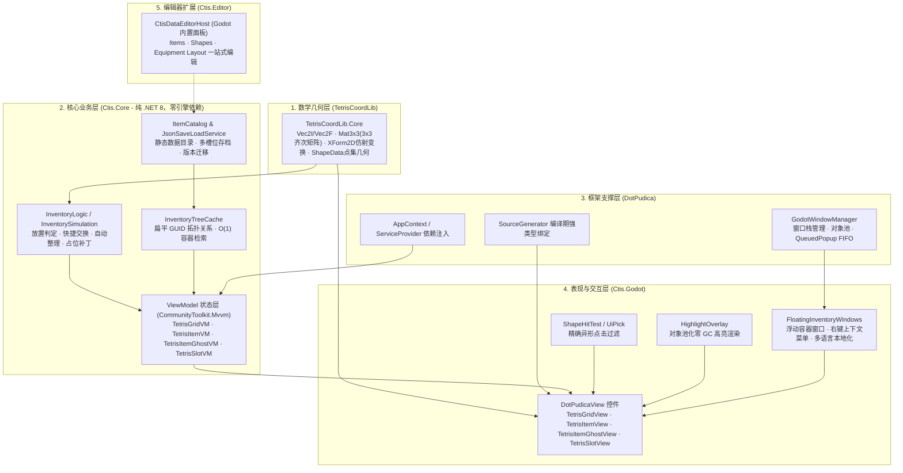

***

## 🧩 核心系统与算法深度解析

<a id="tetris-coordinate-system"></a>

### 1. Tetris 坐标系统 - 仿射变换与数值的艺术

系统的网格容器将连续的 UI 像素空间离散化为二维整数矩阵，所有碰撞、旋转与对齐均基于严格的笛卡尔坐标系运算。

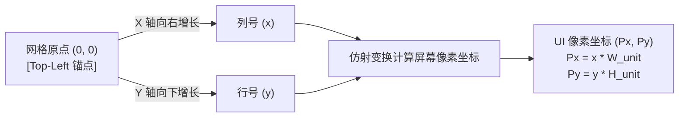

#### 1. 像素位置映射公式

设网格单元像素宽高为 $W\_{unit}, H\_{unit}$，物品在网格中的逻辑原点为 $(x, y)$，则映射至 Godot UI 局部坐标 $(P\_x, P\_y)$ 的仿射变换公式为：

$$
P\_x = x \times W\_{unit}
$$

$$
P\_y = y \times H\_{unit}
$$

> \[!NOTE]
> 在 Godot Control 坐标系中，Y 轴向下为正，与网格逻辑坐标系完全一致，无需进行符号取反，计算更自然高效。

#### 2. 形状定义与四向旋转矩阵算法

物品的占位并非固定的贴图包围盒，而是相对于原点 $(0,0)$ 的离散点集：$\mathcal{S} = \{ (p_{x1}, p_{y1}), (p_{x2}, p_{y2}), \dots, (p_{xn}, p_{yn}) \}$.

顺时针旋转 $90^\circ$ 的二维线性变换矩阵为：

$$
\begin{bmatrix} x' \ y' \end{bmatrix} = \begin{bmatrix} 0 & -1 \ 1 & 0 \end{bmatrix} \begin{bmatrix} x \ y \end{bmatrix} = \begin{bmatrix} -y \ x \end{bmatrix}
$$

```csharp
// TetrisCoordLib.Core / XFormFactory.Rotate90 —— 90° 步进旋转的仿射矩阵
public static XForm2D Rotate90(int quarterTurns)
{
    int n = ((quarterTurns % 4) + 4) % 4;
    return n switch
    {
        1 => new XForm2D(new Mat3x3(0, -1, 0, 1, 0, 0)),  // (x, y) → (-y, x)
        2 => new XForm2D(new Mat3x3(-1, 0, 0, 0, -1, 0)), // (x, y) → (-x, -y)
        3 => new XForm2D(new Mat3x3(0, 1, 0, -1, 0, 0)),  // (x, y) → (y, -x)
        _ => XForm2D.Identity
    };
}
```

矩阵通过 `XForm2D.Apply` / `ApplyBatchRound` 作用于形状点集，配合 `DirUtil.ToQuarterTurns(Dir)` 将四向朝向映射为 0–3 的步进数。

#### 3. 旋转归一化平移（Normalize Transform）

由于绕 $(0,0)$ 轴心旋转会导致负坐标溢出，`ShapeNormalizer` 会在旋转矩阵之后组合一个归一化平移变换（将变换后点集的最小坐标平移回 $(0,0)$），确保物品变换后始终紧贴原点、与网格对齐：

$$
Offset = (-\min_{i} x'\_i,\ -\min_{i} y'\_i)
$$

$$
Target(x, y) = (Origin\_x + x' + Offset\_x,\ Origin\_y + y' + Offset\_y)
$$

```csharp
// TetrisCoordLib.Core / ShapeTransform.Rotate —— 旋转 + 归一化的组合管线
public static ShapeData Rotate(ShapeData shape, int quarterTurns)
{
    var rotate = XFormFactory.Rotate90(quarterTurns);
    var normalize = ShapeNormalizer.ComputeNormalizationXForm(rotate, shape.Width, shape.Height);
    return Transform(shape, rotate.Then(normalize));
}
```

***

<a id="quick-exchange-system"></a>

### 2. 智能快捷交换系统 - 异形物品的拓扑互换与事务回滚

快捷交换（Quick Exchange）允许玩家拖拽一个物品放置在已被占据的区域时，若满足特定几何覆盖条件，系统会自动将被覆盖的异形物品“挤回”并精准放入原拖拽物品腾出的空间中，实现一步互换。

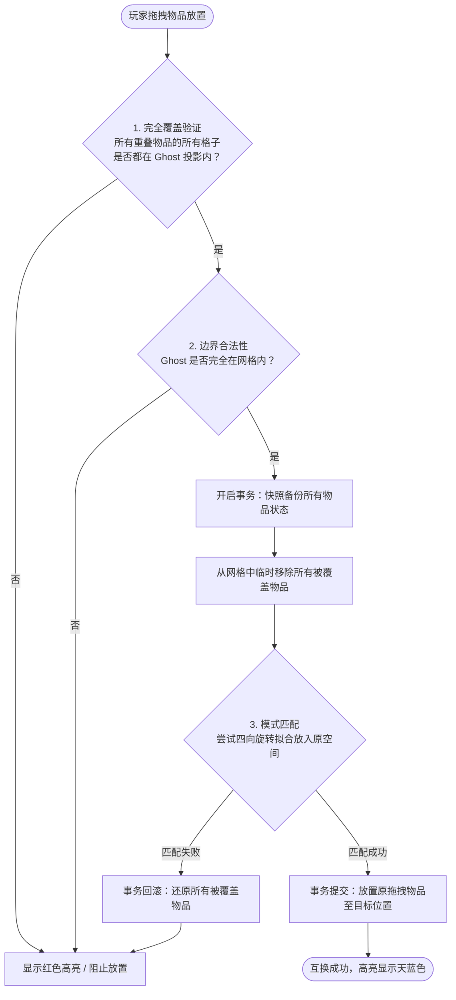

#### 核心判定与映射原理

1. **完全覆盖原则**：Ghost 覆盖集合 $C\_{ghost}$ 必须完全包含所有重叠物品的占据点集 $C\_{item}$：

$$
\forall Item \in Overlap, \quad C\_{item} \subseteq C\_{ghost}
$$

1. **四方向模式匹配（Pattern Matching）**：
   对于被挤出的物品，系统遍历其四个朝向 $dir \in {0^\circ, 90^\circ, 180^\circ, 270^\circ}$，选取原释放区域的参考点 $T\_0$，反推合法锚点并验证点集完全重合：

$$
Anchor = T\_0 - P\_{ref} - Offset\_{rotated}
$$

1. **事务性一致性保障**：整个交换过程具有 ACID 原子性——一旦任何一个被覆盖物品无法在源空间中找到合法契合点，立即全量回滚，绝不残留脏数据。

***

<a id="sprite-mesh-raycast-filter"></a>

### 3. 精确异形命中检测

在游戏 UI 渲染中，所有控件的包围盒默认均为**矩形**。对于 "L" 形、"T" 形或对角线长枪等异形物品，如果直接使用矩形点击，会导致右上角透明空白处拦截鼠标事件，严重破坏密集背包整理的手感。

#### 判定流水线（`ShapeHitTest.cs` & `UiPick.cs`）

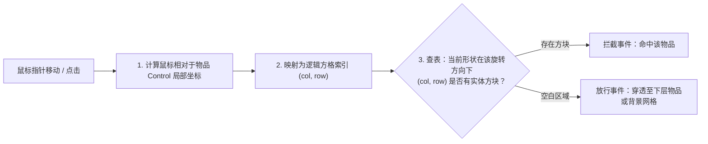

- **体验收益**：多件复杂异形武器并排堆叠时，鼠标悬停与点击精确对应视觉图案，无任何操作盲区。
- **性能优化**：命中判定直接在 ViewModel 派生的占位点集上线性比对，整条路径无堆分配，拖拽过程零 GC 压力。

***

<a id="nested-inventory-guid"></a>

### 4. 背包套娃与树形缓存 - 扁平 GUID 外键模型与 O(1) 检索

在《逃离塔科夫》类游戏中，“背包里装战术胸挂、胸挂里装弹夹、弹夹包里装子弹”是极常见的多层嵌套机制。传统方案直接使用嵌套对象树（`class Bag { List<Item> Items; }`），容易导致递归死锁、序列化层级过深以及内存开销大。

CTIS 引入了类似关系型数据库的 **扁平化存储 +** **`InventoryTreeCache`** **拓扑缓存** 设计：

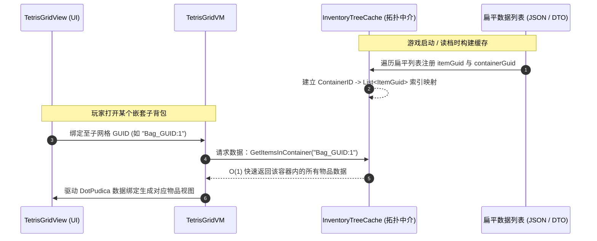

#### 传统树 vs CTIS 拓扑中介对比

| 特性            | 传统嵌套对象树              | CTIS 扁平 GUID + 拓扑缓存                            |
| ------------- | -------------------- | ---------------------------------------------- |
| **内存结构**      | 深度递归引用对象             | 扁平数据列表 + GUID 外键引用                             |
| **容器查找**      | $O(N)$ 递归深搜遍历全树      | **$O(1)$ 字典哈希索引查找**                            |
| **数据安全性**     | 互相装入易发生循环引用死锁        | **Floyd 龟兔赛跑算法 O(1) 空间检测自包含**，放置前阻断循环引用        |
| **UI 视图生命周期** | 关闭 UI 时若销毁对象可能导致数据丢失 | **UI 与数据彻底分离**：关闭面板仅回收 View 节点，数据完好保留在 Cache 中 |
| **惰性加载**      | 启动必须全部反序列化生成对象       | **按需加载**：打开某个背包时才即时从 Cache 获取子节点               |

#### 高性能位棋盘占位检测（OccupancyBoard）

每个容器节点（包括主背包和任意深度的内嵌容器）都挂载一个 `OccupancyBoard` 实例，采用类似国际象棋引擎的**位棋盘（Bitboard）思想**进行 $O(1)$ 碰撞检测：

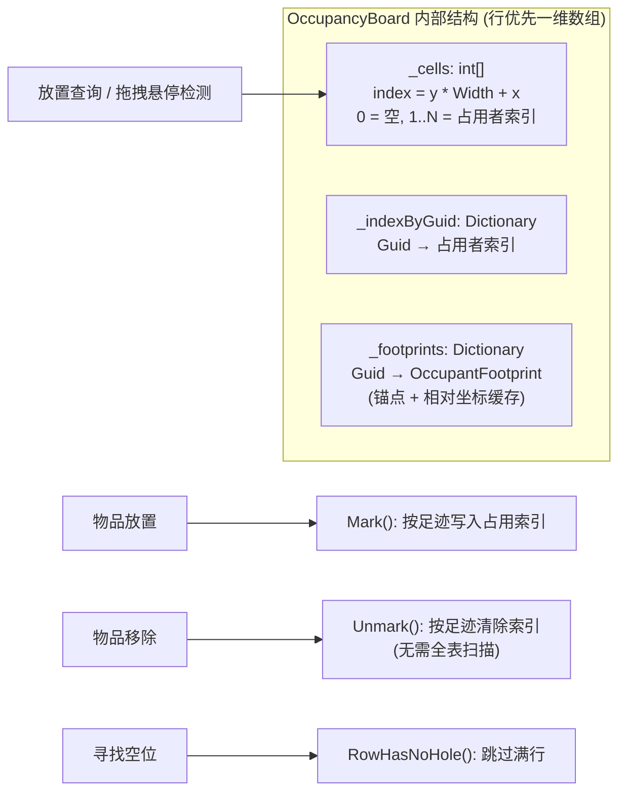

**核心性能优化点：**

1. **一维数组行优先存储**：网格占用信息存储在连续内存的 `int[]` 中，`index = y * Width + x` 直接定位，单格查询 $O(1)$，CPU 缓存命中率极高。
2. **满行跳过优化**：`TryFindFreeOrigin` 搜索空位时先调用 `RowHasNoHole` 检查该行是否已完全填满，直接跳过整行扫描，高填充率下性能提升显著。
3. **无分配覆盖扫描**：`ScanCoverage` 方法统计重叠区域的唯一占用者数量时，仅用两个局部变量计数（0 = 空位、1 = 单物品可交换/堆叠、≥2 = 多物品冲突），**拖拽悬停每帧零 GC 分配**。
4. **足迹缓存增量更新**：每个物品的占据点集作为 `OccupantFootprint` 缓存，移除或移动物品时直接按足迹清除对应格子，无需扫描整个棋盘。
5. **统一嵌套模型**：无论主背包还是物品内嵌的子网格（ContainerId 格式为 `{itemGuid}:{index}`），均使用相同的 `OccupancyBoard` 结构与检测逻辑，嵌套深度对检测性能无影响。

#### 零分配循环依赖检测 - Floyd 龟兔赛跑算法

嵌套背包系统必须防止玩家将物品放入其自身的子容器中（例如把背包 A 放进背包 A 里的小包 B，再把小包 B 放回背包 A 形成死循环）。`InventoryTreeCache.IsDescendantContainer` 采用**字符串前缀快速路径 + Floyd 快慢指针判圈**的组合算法，空间复杂度 $O(1)$，拖拽检测过程零 GC 分配：

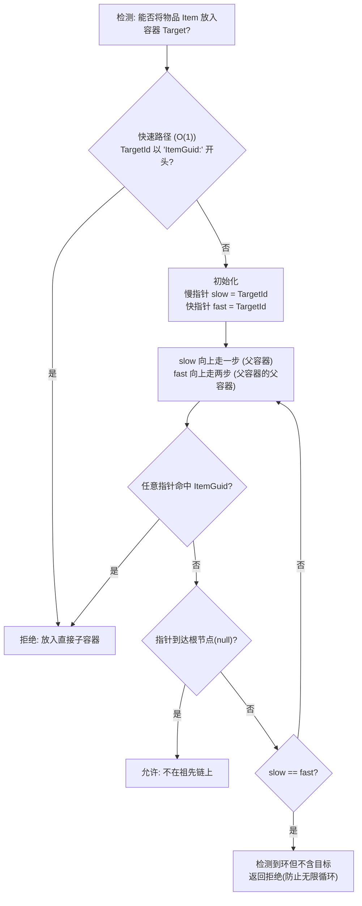

**算法特性：**

1. **前缀快速路径**：容器ID采用 `{父物品Guid}:{网格索引}` 的命名约定（如 `BagA_Guid:0` 表示背包A的第0个内嵌网格），直接通过字符串前缀匹配即可 $O(1)$ 检测直接子容器，无需遍历。
2. **Floyd 快慢指针（龟兔赛跑）**：对于深层嵌套，维护两个指针：
   - **慢指针（乌龟）**：每次向上追溯1层父容器
   - **快指针（兔子）**：每次向上追溯2层父容器
   - 每一步都检查当前容器的所有者是否为目标物品
3. **环检测天然支持**：若快慢指针相遇（`slow == fast`），说明容器树中存在环但环内不含目标物品，立即终止返回，避免无限递归。
4. **零堆分配**：整个检测过程仅使用几个字符串局部变量，无需 `HashSet`/`Stack` 等访问者集合，拖拽悬停高频调用无GC压力。
5. **任意深度支持**：可正确处理背包→胸挂→弹夹包→子弹套……任意深度的嵌套场景。

***

<a id="highlight-system"></a>

### 5. MVVM 幽灵预览与高亮瓦片系统 - 对象池化零 GC 渲染

系统使用 `TetrisItemGhostVM`（幽灵物品）模拟拖拽与悬停放置，在玩家未释放鼠标前，真实背包数据绝不发生变更。

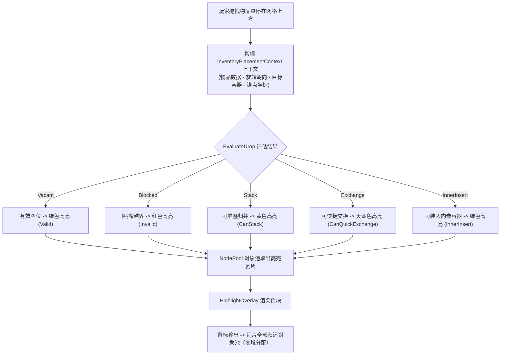

- **数据驱动配置**：所有状态的高亮颜色、透明度均通过 `PlacementConfig.json` 集中配置，可按项目需求自定义。
- **对象池化技术**：借助 `NodePool` 循环复用高亮方块节点，高频拖拽与旋转帧率稳定无卡顿。

***

<a id="floating-window-system"></a>

### 6. 浮动容器窗口与右键菜单 - 无限嵌套的可视化投影

当玩家在背包中右键打开容器类装备（如战术背心、背包、医疗箱）时，系统会动态唤起可拖拽的浮动网格窗口（`FloatingGridWindow`）。

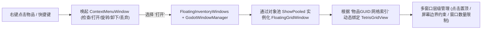

- **多窗口生命周期**：支持同时开启多个各级嵌套窗口，自动维护 Z-Index 聚焦层级与边界防溢出裁剪。
- **动态 GUID 绑定**：浮动窗口内的网格组件与主背包网格使用完全相同的 `TetrisGridView`，通过绑定不同的 GUID 即可复用全部交互逻辑。

***

<a id="organize-system"></a>

### 7. 背包自动整理与高级特性 - 面积贪心排序与占位补丁

#### 1. 一键自动整理（Auto Organization）

支持在单个网格、指定容器或全局范围内调用 `TryOrganizeGrid`。内置 **面积优先（Area-First）** 与权重贪心装箱算法：

1. 提取当前容器内所有物品并按占位面积由大到小排序。
2. 优先尝试标准朝向，若无法容纳则尝试顺时针旋转 $90^\circ$。
3. 自左上向右下寻找首个可容纳锚点，一键完成紧凑规整排列。

#### 2. 动态占位补丁（Occupancy Patch）

支持武器配件改装时动态修改物品的占位形状（如装上长弹匣或消音器后，物品在网格上的占用点集动态扩充；拆下配件后立即缩小还原），并通过 `ApplyOccupancyPatch` 自动同步至数据树。

#### 3. 网络与命令支持（Command & Replay）

所有核心操作均封装为不可变的 `InventoryCommand`（含 `CommandId` 幂等去重与 `ExpectedRevision` 乐观并发校验），天然支持多人联机网络同步回放与撤销重做（Undo/Redo）。命令管线的完整设计详见[命令-仿真-投影管线](#command-pipeline)。

***

<a id="command-pipeline"></a>

### 8. 命令-仿真-投影管线 - 单向数据流的核心引擎

背包的一切状态变更——放置、交换、堆叠、拆分、翻转、整理、占位补丁、容器扩缩——都流经同一条管线：**意图被封装为不可变命令，仿真层以纯函数校验并提交到树，投影层再把成功结果精确刷回 ViewModel**。View 与 ViewModel 从不直接修改数据，`InventoryTreeCache` 是唯一事实源。

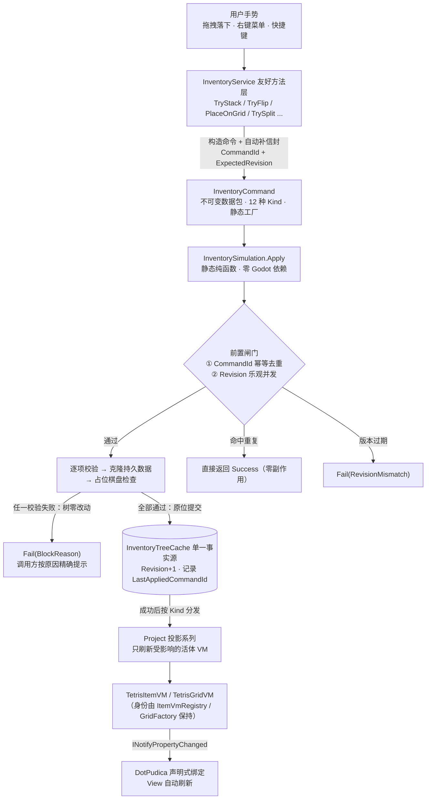

#### 1. 命令包装：意图即数据

- **不可变**：`InventoryCommand` 全部属性为 `init`-only，构造后不可修改——命令天然可序列化、可缓存、可回放
- **静态工厂防误用**：每种 `InventoryCommandKind`（共 12 种）对应一个工厂方法（`InventoryCommand.Place(...)` / `.Flip(...)` / `.Stack(...)` 等），必填参数在签名层面强制，不会出现"半填的命令"
- **信封分离**：`WithEnvelope(commandId, expectedRevision)` 为命令补上回放信封；本地命令由 `InventoryService.Apply` 自动补齐，远程命令必须自带信封且经 `ApplyRemote` 强制校验
- **guid 归权威发放**：新物品身份由 `IItemIdFactory` 统一签发，接口契约明确"联网会话中由权威端持有"，为联机同步预留

```csharp
// 服务层友好方法：意图 → 命令 → 仿真 → 投影，一行完成
public bool TryStack(TetrisItemVM source, TetrisItemVM target)
    => Apply(InventoryCommand.Stack(source.Guid, target.Guid)).Ok;
```

#### 2. 仿真：克隆-校验-提交的纯函数事务

`InventorySimulation.Apply` 是静态纯函数（位于 `Ctis.Core`，零引擎依赖），每个命令处理函数遵循同一模式：

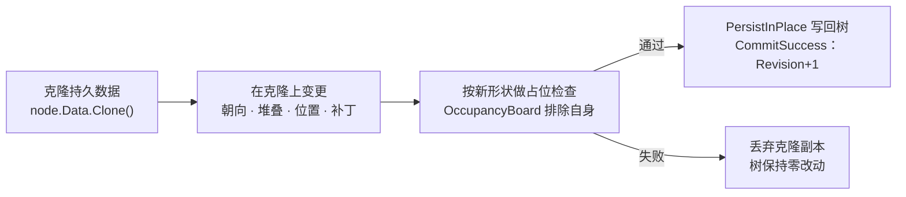

- **失败零痕迹**：校验与变更全部发生在克隆副本上，占位检查通过才写回树——被拒绝的命令不留任何中间态
- **批处理延迟提交**：`Exchange` 等多物品命令先把全部占位者的克隆写入暂存列表，整体校验通过后一次性落盘
- **统一埋点**：每个处理函数自带 `CtisTrace.Scope` 性能剖析作用域
- **两道前置闸门**：
  1. *幂等去重*：`CommandId == LastAppliedCommandId` → 直接返回 Success，网络重复投递安全
  2. *乐观并发*：`ExpectedRevision != Revision` → `RevisionMismatch`，过期命令被拒绝，防止旧命令覆盖新状态

#### 3. 投影：成功之后，精确刷回

`Dispatch` 在仿真前记录物品的原容器，仿真**成功后**按 Kind 分发到最小化的 VM 更新。VM 是树的下游投影缓存，而非第二份状态：

| 命令 | 仿真层校验要点（节选） | 成功后的投影动作 |
|---|---|---|
| `Place` | 容器/物品/目录存在 · 自嵌套禁止 · 占位检查 | `ProjectFrom` + `MoveVmOntoGrid` |
| `MoveToSlot` | 槽位存在 · 类型匹配 · 槽位空闲 | `DetachVmOccupancy`；槽位 VM 由 `PlaceOnSlot` 包装器补充绑定 |
| `Lift` | 物品存在 | `DetachVmOccupancy`（清空原容器占位，物品移入持有容器） |
| `Stack` | 可堆叠 · 容量上限（溢出部分留在源） | 双方 `CurrentStack` 刷新；源被吞没时移除视图并 `Unregister` |
| `Split` | 数量合法 · 新 guid 无冲突 · 相邻位/空位搜索 | `GetOrCreate` 新 VM 并放入网格 |
| `ResizeContainer` | 尺寸裁剪 · 物品重排失败则整体拒绝 | `RefreshFromTree`（整网格重排） |
| `Exchange` | 交换计划需让全部受影响物品合法落位 | 目标网格 + 来源网格分别 `RefreshFromTree` |
| `Flip` / `PatchOccupancy` / `RemoveOccupancyPatch` | 原位占位校验（邻居碰撞即拒绝） | `ProjectItemShape`：`destroyView:false` 移除 → 重投影 → 原位重放置（视图零销毁） |
| `OrganizeContainer` / `OrganizeItemGrids` | 容器存在 · 排序策略 | `RefreshFromTree`（后者按 `guid:` 前缀遍历全部内嵌网格） |

三个关键细节：

- **形状变更统一管线**：`Flip` 与占位补丁共享 `ProjectItemShape`——先以 `destroyView:false` 从网格移除（视图与 VM 均存活），`ProjectFrom` 重算派生状态后原位放回。未来任何"占位可变化"特性（破损缩小、改装扩格）接入同一管线即自动获得校验、回滚与持久化
- **懒物化**：`PlaceOnGrid` 前的 `EnsureSpawned` / `TryEnsureContainer` 支持"先建 VM、后建数据"的写入顺序——如调试面板 `GetOrCreate` 先产出 VM、`EnsureSpawned` 再把 VM 状态物化为树的持久节点；尚无树节点的网格 VM 则由 `ResizeContainer` 命令按需建格。命令执行时树中必有目标，调用方无需"先建容器再放物品"的两段式编排
- **读路径单向**：VM 上的坐标、宽高、占位点集全部从 `(Occupancy, Patches, Direction, FlipH, FlipV)` 派生；用户手势永远走"命令 → 仿真 → 树 → 投影"，不存在 VM 直改数据的旁路

#### 4. 为什么这样设计

- **可回放**：命令不可变 + `CommandId` 幂等 + `Revision` 乐观并发 → 同一命令序列在相同初始树上重放得到相同终态。这是联机同步、断线重连、录像回放与 Undo/Redo 的共同基础
- **可测试**：仿真层是纯函数 + 纯数据（树 + 目录 + 装备布局），不需要 Godot、不需要窗口，直接构造数据即可做确定性单元测试
- **零幽灵状态**：UI 只是投影，"背包里有什么"只有一个权威答案（树）。关掉全部窗口再打开，从树重建即完全恢复
- **失败可解释**：拒绝的命令携带类型化的 `InventoryPlacementBlockReason`（`SlotTypeMismatch` / `SlotOccupied` / `SelfOwnedContainer` / `RevisionMismatch` ...），调用方可据此给出精确的 UI 提示

***

<a id="save-load-system"></a>

### 9. 存档持久化系统 - 包装器模式与版本迁移

`JsonSaveLoadService` 提供了解耦优秀的数据持久化方案：

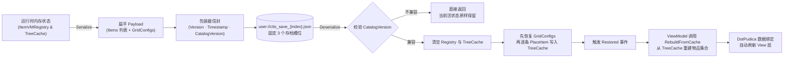

#### 1. 存档文件结构：三层 JSON

```json
{
  "Version": 1,                          // SaveFileWrapper：存档格式版本（结构迁移用）
  "Timestamp": "2026/08/23 12:00:00",
  "Payload": {
    "CatalogVersion": 1,                 // GameSaveData：物品目录版本（兼容性校验）
    "Items": [                           // TetrisItemPersistentData 列表（每物品一条）
      {
        "ItemId": 7, "ItemGuid": "a1b2...", "ContainerId": "depository",
        "OriginPosition": { "X": 3, "Y": 5 }, "Direction": 2,
        "Stack": 12, "IsOnSlot": false, "SlotIndex": -1,
        "CustomData": { }, "OccupancyPatches": [ ... ]
      }
    ],
    "GridConfigs": {                     // 网格尺寸配置（容器 ID → 尺寸）
      "depository": { "Width": 12, "Height": 8 }
    }
  }
}
```

物品条目只记录**持久真身**：身份（`ItemId`/`ItemGuid`）、位置（`ContainerId`/`OriginPosition`/`Direction`/`FlipH`/`FlipV`）、堆叠（`Stack`）、槽位（`IsOnSlot`/`SlotIndex`）、扩展（`CustomData`/`OccupancyPatches`）。形状点集、包围盒宽高等**派生态一概不存**——载入时由 `ItemShape.Resolve` 从 `(Occupancy, Patches, Direction, Flip)` 重新派生，存档因此与几何算法演进天然解耦。默认值字段（false/0）省略不写，文件保持精简。

#### 2. 存储逻辑

- **序列化过滤**：遍历树中全部容器，空的 `Held`（手持中转）容器跳过；`GridConfigs` 只记录"有物品的非槽位/非手持网格 + 主仓库 Depository"，槽位与手持容器的尺寸是布局期常量，无需持久化
- **恢复顺序**：版本兼容 → 清空 Registry 与 TreeCache → **先**恢复 `GridConfigs` **再**逐条 `PlaceItem`（物品落位时容器尺寸已就绪）→ 触发 `Restored`
- **双版本号分离**：`Version`（存档格式结构版本，供未来迁移）与 `CatalogVersion`（物品目录版本，校验物品静态数据兼容）各司其职；不兼容的存档**拒绝载入且不清空当前活状态**，杜绝半新半旧的损坏数据
- **槽位抽象**：`ISaveSlotStore` 接口隔离开销环境——Core 侧 `InMemorySaveSlotStore`（纯内存实例用于测试），Godot 侧 `GodotSaveSlotStore` 写入本地 `user://ctis_save_{index}.json`（固定 3 槽）；`SaveSlotInfo` 只读元数据（`HasData`/`IsCorrupt`/`Timestamp`）不触碰活状态，`LoadSlot` 对"槽位缺失 / JSON 损坏 / 目录不兼容"三种失败统一返回 false
- **序列化配置**：`WriteIndented` 可读性 + `Vec2I`/`Dir` 自定义转换器 + Source Generator 上下文（`CtisJsonContext`），AOT/裁剪友好

***

<a id="item-editor"></a>

### 10. Godot 内置数据编辑器 - 点点鼠标，又增加了一个物品

CTIS 在 Godot 编辑器内集成了全功能可视化数据工作台（**项目菜单 -> 工具 -> CTIS/Data Editor**）：

<div align="center">


</div>

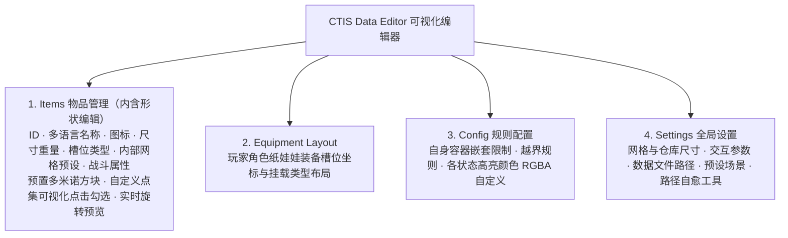

- **双向数据同步**：编辑器保存后直接更新 `ItemCatalog.json`、`PlacementConfig.json` 与 `EquipmentLayout.json`，无需重启编辑器即可生效。
- **多语言编辑**：名称与描述按当前编辑语言写入中英双语词条，本地化键自动生成与重命名。

***

## 🚀 快速使用：最小可运行配置

### A. 环境要求

| 依赖项                     | 最低版本要求                | 说明                                                                             |
| ----------------------- | --------------------- | ------------------------------------------------------------------------------ |
| **Godot Engine**        | **4.7.x .NET** (Mono) | 需支持 C# 的 Godot 4.7 引擎                                                          |
| **.NET SDK**            | **.NET 8.0** SDK      | 推荐 C# 12 编译器环境                                                                 |
| **DotPudica Framework** | 随 Release 包分发         | [GitHub 仓库](https://github.com/Cholopol/dot-pudica-framework.git)，MVVM 框架与源生成器 |
| **TetrisCoordLib**      | 随 Release 包分发         | [GitHub 仓库](https://github.com/Cholopol/tetris-coord-lib.git)，数学几何坐标库          |

### B. 宿主 `.csproj` 依赖注入

在 Godot 编辑器中启用 **CTIS** 插件后，`plugin.gd` 会自动在你的游戏工程 `.csproj` 中注入并维护以下配置块（**无需手动编辑**）：

```xml
<!-- Ctis:Begin -->
  <ItemGroup>
    <Compile Remove="addons/ctis/**/*.cs" />
  </ItemGroup>
  <ItemGroup>
    <Compile Include="addons/ctis/editor/CtisDataEditorHost.cs" />
  </ItemGroup>
  <ItemGroup>
    <ProjectReference Include="addons/ctis/Core/Ctis.Core.csproj" />
    <ProjectReference Include="addons/ctis/Godot/Ctis.Godot.csproj" />
  </ItemGroup>
<!-- Ctis:End -->
```

### C. 服务注册与运行时启动

在游戏的全局入口（如 `Main.cs` 或场景根节点）中配置 DI 依赖注入服务并完成数据加载。以下示例节选自 Demo 的 [GameBootstrap.cs](file:///d:/File/_UnityFile/Cholopol-Tetris-Inventory-System/CTIS_Demo/demo/_Scripts/GameBootstrap.cs)，其中 `IFloatingInventoryWindows` / `IInventorySession` 接口由插件提供，但 `FloatingInventoryWindows` / `InventorySession` 及各窗口类型是 **Demo 侧实现**（位于 `CTIS_Demo/demo/_Scripts/`，不随插件分发）——接入自己的工程时需自行实现这两个接口（或参考 Demo 拷贝），并替换为自己的窗口类型与场景路径：

```csharp
using Godot;
using Ctis.Core;
using Ctis.Presentation;
using DotPudica.Godot.Views;
using Microsoft.Extensions.DependencyInjection;
using AppContext = DotPudica.Godot.AppContext;  // 别名：避免与 System.AppContext 歧义

public partial class GameBootstrap : Node
{
    private AppContext? _app;

    public override void _Ready()
    {
        // 1. 初始化窗口管理器
        var wm = GetNodeOrNull<GodotWindowManager>("WindowManager")
            ?? new GodotWindowManager { Name = "WindowManager" };
        if (wm.GetParent() == null)
            AddChild(wm);

        // 2. 初始化 AppContext 并注册服务
        _app = new AppContext().Initialize(services =>
        {
            services.AddCtis();           // 注册 CTIS 核心业务服务
            services.AddCtisGodot();      // 注册 CTIS Godot 交互服务
            services.AddSingleton<IFloatingInventoryWindows, FloatingInventoryWindows>();  // Demo 实现
            services.AddSingleton<IInventorySession, InventorySession>();                  // Demo 实现
        }, wm);

        // 3. 加载物品目录与配置表
        ItemCatalogLoader.LoadInto(_app.Services.GetRequiredService<IItemCatalog>());
        PlacementConfigLoader.LoadInto(_app.Services.GetRequiredService<PlacementConfig>());
        EquipmentLayoutLoader.LoadInto(_app.Services.GetRequiredService<EquipmentLayout>());

        // 4. 挂载 CTIS 运行时（窗口/幽灵拖拽层，会把 wm 重新挂到 CtisWindowLayer 下）
        CtisRuntime.Attach(this, wm);

        // 5. 配置窗口对象池（场景路径 + 池大小），必须在 ShowPooled 之前调用
        wm.ConfigurePool<InventoryWindow>("res://CTIS_Demo/demo/InventoryWindow.tscn", 1);
        wm.ConfigurePool<FloatingGridWindow>("res://CTIS_Demo/demo/FloatingGridWindow.tscn", 8);
        wm.ConfigurePool<ContextMenuWindow>("res://CTIS_Demo/demo/ContextMenuWindow.tscn", 2);
    }

    public override void _ExitTree()
    {
        // AppContext 只能初始化一次，直到 Dispose；场景退出时必须释放
        _app?.Dispose();
        _app = null;
    }
}
```

### D. 场景视图挂载与绑定

视图分两类：**宿主视图**（自己声明 `[DotPudicaView]` 绑定某个 VM）与**插件内置的池化控件**（`TetrisGridView` / `TetrisItemView` 等，已自带 `[DotPudicaView(..., AutoInitialize = false, Pooled = true)]` 与完整生命周期，**不要从它们派生并重复标注**，否则源生成器会在继承链上生成冲突的生命周期成员）。内置控件由宿主通过 `CtisRuntime.CreateGridView()` 从对象池取出，再以 `BindGrid(vm)` 激活：

```csharp
using Godot;
using Ctis.Core;
using Ctis.Presentation;
using DotPudica.Core.ViewModels;
using DotPudica.Godot.Views;

// 宿主视图：声明自己的 VM，通过 ActivateViewModel 绑定外部 VM（参考 Demo 的 ContainerPanelView）
[DotPudicaView(typeof(ContainerPanelVM), AutoInitialize = false, Pooled = true, Ownership = ViewModelOwnership.External)]
public partial class PlayerBackpackView : VBoxContainer
{
    public override void _Ready() => InitializeView();
    public override void _ExitTree() => RecycleView();  // 池化视图回收：解绑但不销毁节点

    public void BindPanel(ContainerPanelVM vm) => ActivateViewModel(vm);

    partial void OnViewModelBound()
    {
        // 从对象池取出内置的 TetrisGridView，并绑定 ContainerPanelVM 的网格 VM
        var gridVm = ViewModel!.GetOrCreatePersistentGrid(0, width: 8, height: 6);
        var gridView = CtisRuntime.CreateGridView();
        AddChild(gridView);
        gridView.BindGrid(gridVm);
    }
}

// 池化窗口（如 Demo 的 FloatingGridWindow）：窗口本身也是一个宿主视图
[DotPudicaView(typeof(FloatingGridVM), Pooled = true)]
public partial class FloatingGridWindow : GodotWindow
{
    public override void _Ready() => InitializeView();

    public override void _ExitTree()
    {
        RecycleView();  // 对象池复用：解绑但不销毁节点
        base._ExitTree();
    }
}
```

### E. 快捷键与操作说明

| 操作 / 按键          | 触发动作               | 逻辑说明                               |
| ---------------- | ------------------ | ---------------------------------- |
| **鼠标左键拖拽**       | 拿起 / 移动物品          | 激活 `TetrisItemGhostVM`，进入放置预览状态    |
| **R 键**          | 顺时针旋转物品 $90^\circ$ | 动态变换点集并重新计算归一化平移与高亮状态 |
| **鼠标右键**         | 弹出上下文菜单            | 快捷执行查看属性、旋转、卸下、丢弃、打开子容器等操作         |
| **B 键**          | 打开 / 关闭主背包面板       | 切换背包 UI 显示，触发视图进树与出树生命周期           |
| **F1 键**         | 打开 / 关闭调试物品面板      | 实时测试任意物品生成         |

***

## 🤝 贡献指南

欢迎提交 Issue 报告缺陷或发起 Pull Request 贡献代码！请遵循以下规范：

- **代码规范**：遵循 C# 官方编码风格，类型与公开成员采用 `PascalCase`，局部变量采用 `camelCase`，核心接口需添加标准的 XML 注释文档。
- **架构约定**：保持 `Ctis.Core` 与 `TetrisCoordLib.Core` 对 Godot 引擎的**零依赖**，所有引擎相关代码必须收敛于 `Ctis.Godot` 与 `TetrisCoordLib.Godot` 中。
- **测试验证**：目前需要自行编写测试脚本进行测试。

***

## 📜 许可声明与开源协议

- 本项目采用 **Apache License 2.0** 许可证开源。详情请参阅 [LICENSE](LICENSE) 文件。
- 衍生项目或商业工程中必须包含 [NOTICE.txt](NOTICE.txt) 声明文件。
- 根据 Apache 2.0 协议 **Section 4(b)** 条款，商业项目中使用的源码版权声明不得移除；若对源码进行修改，必须在文件头注明修改者与修改日期：

```csharp
// Modified by [Your Name] [Year]:
// [Brief description of changes]
```

> \[!WARNING]
> **严禁将本项目用于任何形式的抄袭、洗稿、盗版倒卖等侵害开源权益的行为。开源精神需要共同守护，欢迎各位向作者本人提供相关侵权线索。**

***

## 📬 联系方式

如果你在接入或使用过程中遇到任何问题，或有深入交流的想法，欢迎通过以下方式联系：

- 📧 **电子邮箱**：`cholopol@163.com`
- 📺 **Bilibili 主页**：[鹿卜Cholopol](https://space.bilibili.com/88797367)
- 💬 **GitHub Issues**：[提交反馈与建议](https://github.com/Cholopol/Cholopol-Tetris-Inventory-System/issues)

