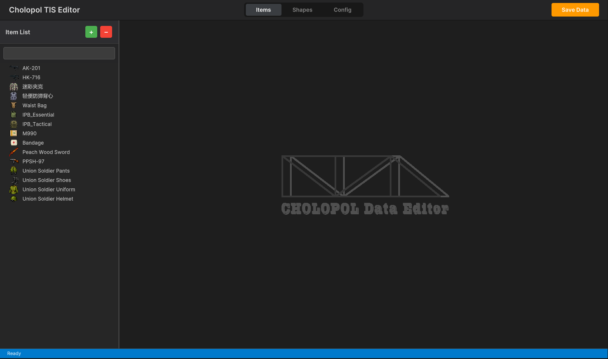
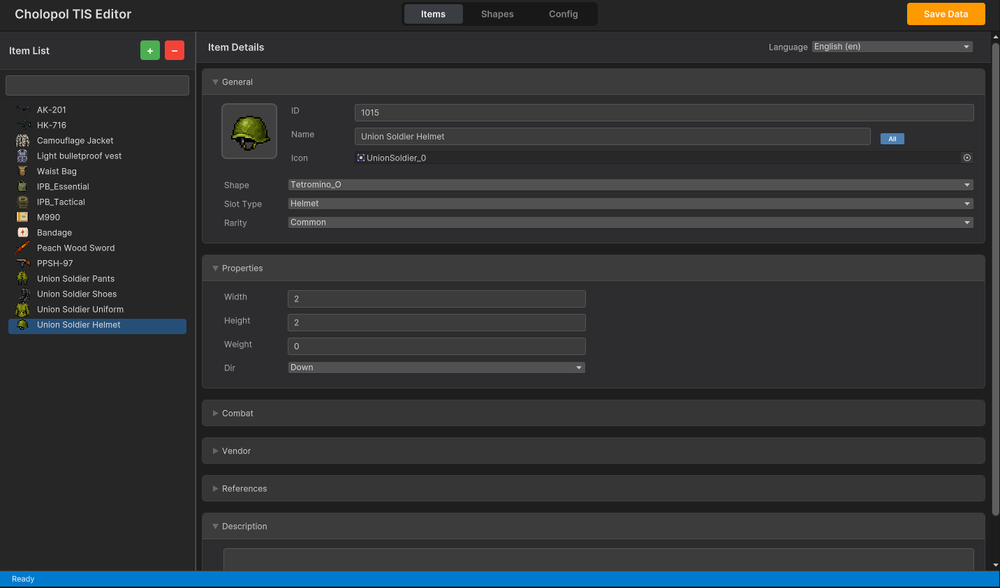
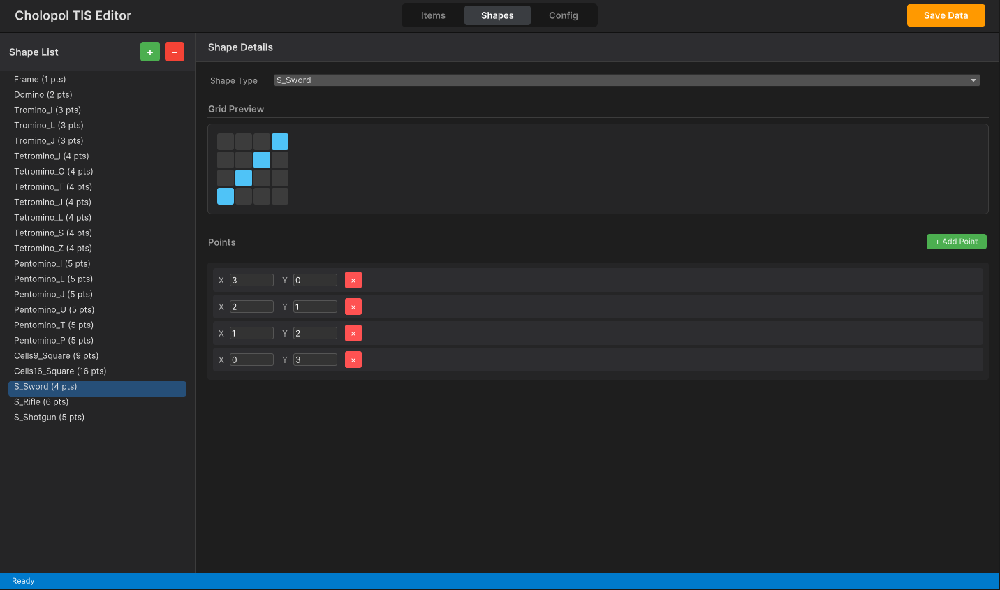
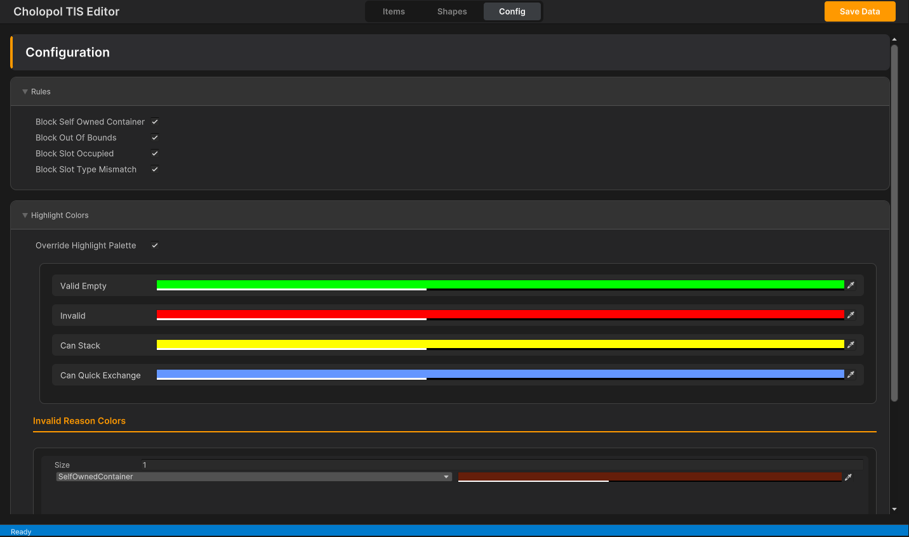
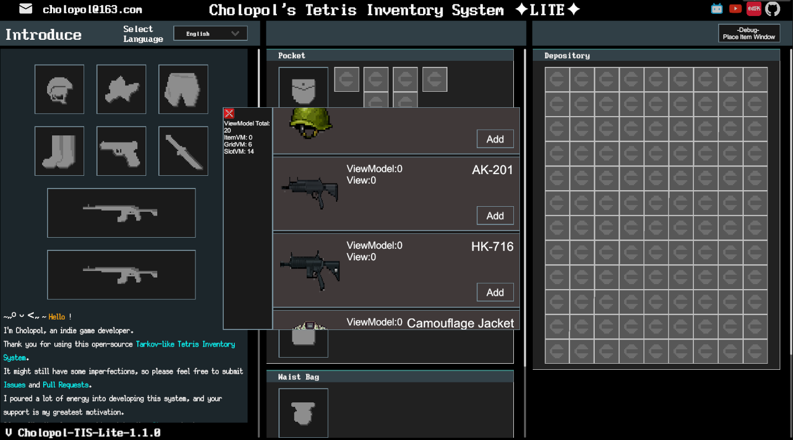

# **Cholopol's Tetris Inventory System**


[](https://cholopol.github.io/Cholopol-Tetris-Inventory-System/)
[](https://space.bilibili.com/88797367)


English | [中文](./README.md)


This is an advanced inventory management system built on Unity Engine 2022, developed using the MVVM (Model-View-ViewModel) architecture. It features deep decoupling of data logic and UI presentation, perfectly replicating the core experience of *Escape from Tarkov*. It supports irregular item shapes, infinite nesting, and extremely high customizability.

## 📕 Table of Contents

- [⭐ Core Features](#core-features)
- [🚀 Quick Start](#quick-start)
- [🎭 Third-party Dependencies](#third-party)
- [👨‍💻 Core Components](#core-components)
- [👨‍💻 Loxodon MVVM Architecture - Long Live Open Source](#loxodon-mvvm)
- [👨‍💻 Tetris Coordinate System - The Art of Numbers](#tetris-coordinate-system)
- [👨‍💻 Quick Exchange System - Intelligent Exchange of Different Items](#quick-exchange-system)
- [👨‍💻 SpriteMeshRaycastFilter - Precise Tetris Shape Operation Filter](#sprite-mesh-raycast-filter)
- [👨‍💻 Nested Inventory - Infinite Nesting with GUIDs and MVVM](#nested-inventory-guid)
- [👨‍💻 InventoryTreeCache - The Navigator for TetrisItems](#inventory-tree-cache)
- [👨‍💻 Highlight Tile System - Customize Your Inventory with Colorful Highlights](#highlight-system)
- [👨‍💻 Customized Item Editor - Add Items with a Few Clicks](#item-editor)
- [👨‍💻 Runtime Debug Panel - Convenient Testing Tool](#runtime-debug-panel)
- [👨‍💻 Floating Container Window System - Infinite Nested Visualization](#floating-window-system)
- [👨‍💻 Save/Load System - Persist Your Inventory State](#save-load-system)
- [🤝 Contributing](#contributing)
- [🔧 Future Improvements](#future-improvements)
- [📜 License](#license)
- [📬 Contact](#contact)
- [☕ Buy Me a Coffee - ❤️ Your Support is My Greatest Motivation](#sponsor)

<a id="core-features"></a>

## ⭐ Core Features

- 🧩 **Perfect Tetris Tile Design**: Supports item rotation, grid-based placement logic, and diverse operations, filtering user actions based on Tetris shapes.
- 🏗️ **MVVM Architecture**: Item/Grid/Slot/Ghost systems implement View/ViewModel/Model decoupling.
- 💾 **Save System**: Powerful serialization system for persisting inventory states.
- 🛠️ **Custom Editor**: Built-in UI Toolkit editor for easy item creation.
- 🌍 **Localization**: Integrated multi-language support.


<a id="quick-start"></a>

## 🚀 Quick Start

### Requirements

- Unity 2022.3.62f3 or higher.

### Import Steps

- Clone the repository:

```json
git clone https://github.com/Cholopol/Cholopol-Tetris-Inventory-System.git
```

- Open the project in Unity Hub.
- Wait for Unity to import assets and dependencies.

### Basic Usage Example

- Navigate to `Assets/Cholopol_Tetris_Inventory_System_Samples/Demo/Scenes/`.
- Open the `EFT Like UI` scene.
- Click Play.
- Controls:
  - Press **B**: Open/Close Inventory.
  - Press **R**: Rotate item while dragging.
  - **Left Mouse Button**: Drag items.
  - **Right Mouse Button**: Open item context menu.

<a id="third-party"></a>

## 🎭 Third-party Dependencies

Generally, no manual installation is required. If you encounter issues, please refer to the following:

### Loxodon Framework

Loxodon Framework is an excellent open-source MVVM framework for Unity, simple and easy to use. Repository: <https://github.com/vovgou/loxodon-framework.git>
It is installed in this project by adding the following to `Packages/manifest.json`:

```plaintext
{
  "dependencies": {
    // ...
    "com.unity.modules.xr": "1.0.0",
    "com.vovgou.loxodon-framework": "2.6.7"
  },
  "scopedRegistries": [
    {
      "name": "package.openupm.com",
      "url": "https://package.openupm.com",
      "scopes": [
        "com.vovgou"
      ]
    }
  ]
}

```

For issues, refer to the official installation guide: <https://github.com/vovgou/loxodon-framework/blob/master/Installation.md>

### Localization

Uses the official Unity Localization package. Install `com.unity.localization` via Unity Package Manager.

### Newtonsoft-json

High-performance JSON serialization tool. Install `com.unity.nuget.newtonsoft-json` via Unity Package Manager.

<a id="core-components"></a>

## 👨‍💻 Core Components

### 1. MVVM Architecture Implementation

Abandoning traditional MonoBehaviour strong coupling, we adopt data-driven development. Here are some examples:

#### ViewModel (TetrisGridVM, TetrisItemVM)

- The brain of the system. `TetrisGridVM.cs` maintains a 2D array `_tetrisItemOccupiedCells` to record grid occupancy. Pure logic operations do not depend on any `UnityEngine.Object`.
- `TetrisItemVM.cs` handles item rotation state (`_rotated`), coordinates, and size data.

#### View (TetrisGridView, TetrisItemView)

- Responsible for display. They listen for property changes in the ViewModel (such as position or rotation changes) and automatically update the UI.

### 2. Global Interaction Management

`InventoryManager.cs` is the commander of the system (Singleton). It does not handle specific grid logic but coordinates:

- **Input Handling**: Listens for global keys (e.g., R to rotate, B to toggle inventory) in `Update()`.
- **Raycasting**: Uses `GetGridViewUnderMouse()` to determine in real-time which grid the mouse is hovering over and updates `selectedTetrisItemGridVM`.
- **Visual Feedback**: Calls the `inventoryHighlight` component to render green (valid) or red (conflict) highlight blocks on the UI based on the "placeable" result returned by the ViewModel.

### 3. Data Persistence System

The save system is driven by `InventorySaveLoadService.cs`:

- **Data Separation**: All static item data (icon, name, shape) is stored in `ItemDataList_SO`, while dynamic data (position, rotation, container ID) is deserialized from JSON into `InventoryData_SO` for runtime caching and editor-time monitoring.
- **GUID Mapping**: Every grid container and item has a unique GUID. The system automatically reconstructs the ViewModel tree based on GUIDs and notifies the View layer to generate corresponding UI prefabs.

<a id="loxodon-mvvm"></a>

## 👨‍💻 Loxodon MVVM Architecture - Long Live Open Source

### 1. Model Layer

**Responsibility**: Defines the "shape" of data, containing no business logic.

- **Static Data**: Uses `ScriptableObject` to store game configuration.
- Example: The `ItemDetails` class defines item name, icon, grid shape (Point Set), etc.
- **Runtime Data**:
- `InventoryData_SO` stores player inventory runtime data (item state, position, etc.).
- `InventorySaveLoadService` acts as the data warehouse service, responsible for injecting Model data into the ViewModel.

### 2. ViewModel Layer

**Responsibility**: Acts as a bridge between View and Model, holding the state required by the View and processing logic.

- **Inheritance**: Inherits from `ViewModelBase` (Loxodon Framework).
- **Core Mechanism**: Relies on Loxodon Framework's data binding methods to control data flow, typically `View←ViewModel` or `View←→ViewModel`.
- **Property Notification**: Uses the `Set(ref _field, value)` method. When a property value changes (e.g., GridSizeWidth), it automatically notifies the bound View to update.
- **Logic Encapsulation**:
  - `TetrisSlotVM`: Maintains item slot occupancy and determines if an item can be placed.
  - `TetrisGridVM`: Calculates grid occupancy (`_tetrisItemOccupiedCells`) and determines if an item can be placed.
  - `TetrisItemVM`: Manages individual item state (rotation direction `_dir`, coordinates `_localGridCoordinate`).

### 3. View Layer

**Responsibility**: Visual presentation, converting user input into ViewModel commands.

- **Inheritance**: Inherits from `UIView` or specific base classes (e.g., `TetrisItemContainerView<TetrisGridVM>`).
- **Core Mechanism**:
- **Data Binding**: In `TetrisGridView.cs`, you can see code like:

```plaintext
this.SetDataContext(_viewModel); // Set data context
// Loxodon then automatically syncs VM properties to View components
```

- **Event Listening**: The View listens for Unity events like `OnPointerEnter` and forwards them to the Manager or directly calls VM methods.

### 🔄 Data Flow Example

Taking "Rotate Item" as an example:

- **User Action**: Player presses the **R** key.
- **Manager**: `InventoryManager.cs` captures the key press and calls `RotateItemGhost()`.
- **ViewModel**: Code modifies the `_rotated` property of `TetrisItemVM`.

```plaintext
// TetrisItemVM.cs  
public bool Rotated { get => _rotated; set => Set(ref _rotated, value); }
```

- **Framework**: Loxodon Framework detects the `Rotated` property change and automatically triggers binding.
- **View**: `TetrisItemGhostView.cs` receives the change notification and updates the `RectTransform` rotation.

<a id="tetris-coordinate-system"></a>

## 👨‍💻 Tetris Coordinate System - The Art of Numbers

### 1. Core Design Overview

The grid container design is based on classic Tetris variant logic, combined with MVVM architecture and Cartesian coordinates. By discretizing continuous UI space into a 2D integer matrix, the system achieves precise item placement, rotation, and collision detection. Once again demonstrating that human wisdom surpasses LLM large models.

- Key Class Responsibilities:
  - `TetrisGridVM` (ViewModel): Responsible for pure logic calculations. Maintains a `TetrisItemVM[,]` 2D array as the "logical grid" to record which item occupies each cell.
  - `TetrisGridView`: Responsible for UI rendering. Converts ViewModel logical coordinates to Unity UI (`RectTransform`) screen pixel coordinates.
  - `TetrisUtilities`: Provides underlying mathematical operation support, especially matrix rotation algorithms.

### 2. Coordinate System and Mathematical Formulas

#### 1. Grid Coordinate Definition

The system uses a coordinate system with the top-left corner as the origin (0,0) (corresponding to Top-Left anchor in UI layout).

- X-axis: Increases to the right.
- Y-axis: Increases downwards.
Data Structure:

```plaintext
// TetrisGridVM.cs
private TetrisItemVM[,] _tetrisItemOccupiedCells; // [width, height]
```

### 3. Pixel Position Calculation Formula

The formula to convert logical grid coordinates $(x, y)$ to UI local coordinates $(P_x, P_y)$ is:

$$
P_x = x \times W_{unit}
$$
$$
P_y = - (y \times H_{unit})
$$

- $x, y$: Integer coordinates of the item in the grid (column, row).
- $W_{unit}, H_{unit}$: Pixel width/height of a single grid unit (usually defined in `Settings.gridTileSizeWidth`, default 20f).
- Note: $P_y$ is negative because in Unity UI coordinate system, Y-axis is positive upwards, while grid layout is typically arranged downwards (like text flow).
Code Implementation Reference:

```plaintext
// InventoryHighlight.cs (similar logic)
Vector2 tilePos = new Vector2(
    (point.x + ghost.RotationOffset.x) * tileW,
    -((point.y + ghost.RotationOffset.y) * tileH) // Y-axis negative
);
```

### 4. Item Shape and Rotation Algorithm

The cells occupied by an item are defined as a set of coordinate points `List<Vector2Int>` relative to the item's origin $(0,0)$.

Rotation Transformation Formula (Clockwise 90°):
For any point $(x, y)$ in the shape, its new coordinates $(x', y')$ after rotation are:

$$
x' = -y
$$
$$
y' = x
$$

Code Implementation:

```plaintext
// TetrisUtilities.cs
public static List<Vector2Int> RotatePointsClockwise(List<Vector2Int> points)
{
    List<Vector2Int> rotatedPoints = new();
    foreach (var point in points)
    {
        rotatedPoints.Add(new Vector2Int(-point.y, point.x)); // Core rotation formula
    }
    return rotatedPoints;
}
```

Rotation Offset Correction:
Simple rotation causes the shape to shift out of its original bounds (since it pivots around 0,0). The system introduces `RotationOffset` to correct the origin position after rotation, ensuring the item remains aligned with the grid.

$$
Offset_{Up} = (Width - 1, Height - 1)
$$

Different directions have different hardcoded offsets, see `TetrisUtilities.cs:L66`.

### 5. Logic Implementation Details

#### 1. Collision Detection

When placing an item, the system iterates through all points $(p_x, p_y)$ occupied by the item and adds the base coordinate $(O_x, O_y)$:

$$
Target(x, y) = (O_x + p_x + Offset_x, O_y + p_y + Offset_y)
$$

Validation Conditions:

1. Boundary Check: $0 \le Target_x < GridWidth$ and $0 \le Target_y < GridHeight$
2. Occupancy Check: `_tetrisItemOccupiedCells[Target_x, Target_y]` must be null.

#### 2. Item Placement

Once validation passes, the item is "written" into the logical grid:

1. Mark all `Target(x, y)` coordinates in `_tetrisItemOccupiedCells` as references to the item.
2. Update the View layer, calculating the `RectTransform`'s `anchoredPosition` based on the formula.

### 6. Pros and Highlights

#### 1. Mathematical Purity:

- Converts complex UI interactions into simple matrix operations.
- The rotation algorithm uses standard linear algebra transformations. The position calculation algorithm is known as Affine Transformation in computer graphics, ensuring logical rigor.

#### 2. MVVM Separation:

- Logic First: All collision, rotation, and position calculations are done in the VM layer (pure C# classes), independent of Unity's Transform or Physics. This makes logic extremely efficient and easy to unit test.
- View Layer "Dumbed Down": The View is only responsible for setting positions based on coordinates calculated by the VM and does not participate in logical judgment.

#### 3. High Performance:

- O(1) Lookup: Directly access the state of any grid cell via a 2D array without iteration.
- Zero GC: The core highlight system uses object pooling, and coordinate calculations are entire based on structs (`Vector2Int`), avoiding heap memory allocation.

#### 4. Flexible Shape Definition:

- Shapes are not preset textures but sets of coordinate points. This means you can easily create arbitrary irregular shapes (like L-shapes, T-shapes, diagonal lines, or even hollow shapes).

### 7. Summary

Linear algebra is the underlying skeleton of the Tetris coordinate system:

- Linear transformation is responsible for rotation.
- Vector addition is responsible for movement.
- Matrix operations are responsible for projecting block coordinates onto screen pixels.

<a id="quick-exchange-system"></a>

## 👨‍💻 Quick Exchange System - The Mathematical Beauty of Smart Item Swapping

Quick Exchange is one of the most technically deep features of this system. When a player drags an item and places it in a position already occupied by other items, if specific conditions are met, the system automatically "squeezes" the covered item back to the original position of the dragged item, achieving smart swapping.

### 1. Core Judgment Conditions

Triggering Quick Exchange requires satisfying the following conditions simultaneously:

1. **Full Coverage Principle**: The Ghost's coverage area must **completely contain** all cells of the covered item. In other words, every cell of the covered item must fall within the Ghost's projection range.
2. **No Boundary Overflow**: All projection cells of the Ghost must be within the legal boundaries of the target grid.
3. **Fit in Original Place**: The squeezed-out item must find a valid placement scheme in the original position of the dragged item.

### 2. Coverage Area Calculation Formula

#### Ghost Coverage Area

Let the Ghost's target anchor coordinate be $T = (T_x, T_y)$, the shape coordinate point set be $S = \{P_1, P_2, ..., P_n\}$, and the rotation offset be $O = (O_x, O_y)$.

The set of all cells occupied by the Ghost on the grid $C_{ghost}$ is defined as:

$$
C_{ghost} = \{ (T_x + P_i.x + O_x, T_y + P_i.y + O_y) \mid P_i \in S \}
$$

#### Covered Item Area

For an item $Item$ already placed in the grid, let its anchor be $A = (A_x, A_y)$, shape point set be $S_{item}$, and rotation offset be $O_{item}$.

The set of cells occupied by this item $C_{item}$ is:

$$
C_{item} = \{ (A_x + P_j.x + O_{item}.x, A_y + P_j.y + O_{item}.y) \mid P_j \in S_{item} \}
$$

### 3. Full Coverage Validation

The system first collects the set of all items overlapping with the Ghost coverage area $Overlap$:

$$
Overlap = \{ Item \mid C_{item} \cap C_{ghost} \neq \emptyset \}
$$

Then verifies the **Full Coverage Condition** for each overlapping item:

$$
\forall Item \in Overlap: C_{item} \subseteq C_{ghost}
$$

If any item is not fully covered (i.e., has cells falling outside the Ghost projection), Quick Exchange cannot be triggered, and red highlight is shown.

### 4. Grid Mapping Algorithm

After full coverage validation passes, the system needs to calculate how the squeezed-out item should be placed in the original area of the dragged item. This is implemented via **Grid Mapping**.

#### Coordinate Mapping Formula

For each cell $cell \in C_{item}$ of the covered item, calculate its offset relative to the Ghost anchor:

$$
relative = cell - T - O_{ghost}
$$

Find index $k$ in the Ghost shape point set $S_{ghost}$ such that:

$$
S_{ghost}[k] = relative
$$

Then use the corresponding point of the original item (dragged item) to calculate the original grid coordinate:

$$
origin\_cell = A_{original} + O_{original} + S_{original}[k]
$$

Finally establishing the mapping relationship:

$$
Mapping: cell \rightarrow origin\_cell
$$

### 5. Pattern Matching Placement

The squeezed-out item needs to find a valid placement scheme in the original item area. The system adopts **Four-Direction Rotation Pattern Matching**:

For each direction $dir \in \{Down, Left, Up, Right\}$:

1. Calculate the rotation point set $S_{rotated}$ under this direction.
2. Calculate the corresponding rotation offset $O_{rotated}$.
3. Select the top-left reference point $T_0$ of the target area.
4. Attempt to align each point $P_{ref}$ in $S_{rotated}$ to $T_0$, reverse deriving the anchor:

$$
Anchor = T_0 - P_{ref} - O_{rotated}
$$

5. Verify if all cells under this anchor exactly match the target area:

$$
\forall P \in S_{rotated}: (Anchor + P + O_{rotated}) \in TargetCells
$$

If a match is found and the area is vacant, placement is completed.

### 6. Transactional Rollback Mechanism

The entire Quick Exchange process adopts a **Transactional Design**:

```plaintext
1. Save original states of all covered items (position, direction, rotation offset, shape coordinates)
2. Remove all covered items from the target grid
3. Attempt to place covered items into the original item area
4. If any item cannot be placed → Rollback: Restore all items to original states
5. Verify if target area is cleared
6. If not cleared → Rollback
7. Place dragged item into target position
8. Exchange Complete
```

This design ensures data consistency—either all succeed or completely rollback, preventing intermediate states.

### 7. Algorithm Complexity Analysis

| Operation | Time Complexity |
| --- | --- |
| Coverage Building | $O(n)$, where $n$ is shape point count |
| Overlap Detection | $O(n)$, Hash lookup |
| Full Coverage Check | $O(m \cdot n)$, where $m$ is overlap item count |
| Grid Mapping Calc | $O(n^2)$, worst case |
| Pattern Match Place | $O(4 \cdot n^2)$, 4-direction traversal |

In typical scenarios ($n < 10$, $m \leq 3$), the entire Quick Exchange judgment completes in milliseconds.

<a id="sprite-mesh-raycast-filter"></a>

## 👨‍💻 SpriteMeshRaycastFilter - Precise Tetris Shape Operation Filter

Its role is to make mouse clicks more precise, responding only to the "actual shape" area of the object and ignoring transparent blank areas. In Unity (and most game engines), all images are **rectangular** by default.
For example:

Imagine you have an "L" shaped Tetris block:

``` plaintext
🟥
🟥
🟥 🟥
```

But in the computer's eyes, it is actually wrapped in a transparent rectangular box:

``` plaintext
🟥 ⬜ 
🟥 ⬜  <-- The white ⬜ here is transparent, but in UI logic it belongs to this Object
🟥 🟥
```

Without this script:
When you click on the blank space (⬜) at the top right, although it looks like you clicked on air, or a piece of equipment behind it, the system will judge that you clicked on this "L" shaped block. This leads to frequent "accidental clicks" for players—intending to click on something behind, but getting blocked by the transparent edge of the front object.

**This script is like a precise "cutting knife". It tells Unity's click detection system (Raycaster):** "Only count as clicking me when the mouse truly hits those colored grid blocks. If clicked on a transparent grid, please ignore me and let the click pass through."

This script hangs on Item UI and Item Ghost UI. Whenever you move the mouse or click, it quickly performs the following three steps of judgment:
1. Locate: It first sees where your mouse is on the current Image (e.g., top-left, bottom-right).
2. Lookup: It reads the "shape data" of this item (is it L-shaped, T-shaped, or square?). It knows which grids have stuff and which are empty.
   - Code Reference: `TryGetShapeConfig` method asks the ViewModel: "What shape are you?"
3. Judgment:
   - If the grid corresponding to the mouse position has something -> Intercept Click (Return `true`, counts as hit).
   - If the grid corresponding to the mouse position is empty -> Pass Click (Return `false`, as if this object doesn't exist, you can click on things behind it).
   - Code Reference: `IsRaycastLocationValid` is the core referee.

Its necessary roles are:

- For Experience: In inventory management games, items are stacked densely. If such "irregular click" is not supported, players will feel very uncomfortable when picking up complex-shaped items, often clicking wrong.
- For Performance: Optimizations (`_cachedPoints`) are done in the script to "remember" the shape. As long as the item doesn't rotate or deform, it doesn't need to recalculate every time.

<a id="nested-inventory-guid"></a>

## 👨‍💻 Nested Inventory - Infinite Nesting with GUIDs and MVVM

In Cholopol-Tetris-Inventory-System, inventory nesting (e.g., a backpack containing a body armor, which contains a bandage) and restoration are implemented through a combination of GUID indexing and `InventoryTreeCache`. This design avoids complex recursive object structures, flattening data storage and reconstructing it into a logical tree structure at runtime.

### GUID Chain Reference

Every "container" (like pockets, backpack grids) and every "item" in the system has a unique GUID:

- **Container**: Represented by `ContainerNode`, having a `ContainerId`.
- **Item**: Represented by `ItemNode`, having an `ItemGuid`.
- **Nesting Relationship**:
  - Each item datum (`TetrisItemPersistentData`) contains a `containerGuid` field pointing to its parent container.
  - If an item itself is also a container (e.g., body armor), it possesses its own grid group. The IDs of these grids are associated with the item's GUID, and the cache manager maintains a mapping table.

### Data Reconstruction Process

When `BuildRuntimeCache()` is called, the system traverses all item data and builds an index in the Cache.

- Flat Data Input: `InventoryData_SO` provides a list `List<TetrisItemPersistentData>` containing all items. Each item has `itemGuid` and `containerGuid` (pointing to the container it is in).
- Build Index (`PlaceItem`):
  - Iterate through each item in the list.
  - Call `cache.PlaceItem(containerId, data)`.
  - Key Action: Cache finds or creates a `ContainerNode` and adds the item data to that node's list.
  - Result: Cache internally forms a `ContainerID -> List<Items>` mapping relationship.

### Nested Restoration Mechanism

The restoration process does not generate all UI at once, but is **Recursively On-Demand**.

- Step 1: Top-level Container Binding
  1. On Start or when UI opens, the system first identifies existing persistent grids in the scene (e.g., main backpack panel on the player). The system reads the `DataGUID` component on that panel to get the GUID (e.g., `Depository_GUID`).
  2. Call `TetrisGridFactory.BindViewToGuid(gridView, guid)`.
- Step 2: VM Initialization and Data Pulling
  1. When `TetrisGridVM` is bound to a GUID, it executes `PrimeFromCache()` (data population):
  2. Ask Cache: VM sends a request to `InventoryTreeCache`: "Please give me all items in `Depository_GUID`."
  3. Get Data: Cache returns `IEnumerable<TetrisItemPersistentData>` object.
  4. Generate Sub-items: VM iterates through this data, creating a child `TetrisItemVM` for each item.
- Step 3: Recursive Processing
  1. If the generated sub-item itself is also a container (e.g., a "Tactical Rig"):
  2. Identify Container: The `TetrisItemVM` of that sub-item is marked as having internal grids.
  3. Assign GUID: The GUID of the sub-grid is usually the item's `itemGuid` plus a hierarchy index, e.g.:

    ```json
    "persistentGridGuid": "ff3764e8-5a2e-43d4-9b4e-cafdc418ca84:3"
    ```

  4. Recursive Trigger:
  - When the player **Opens** the UI of this "Tactical Rig", a new `TetrisGridView` is created.
  - This new View binds to the aforementioned sub-grid GUID.
  - Repeat Step 2: The VM bound to the new View asks Cache again: "Please give me all items in `ChestRig_GUID`."
  - Cache returns data for magazines, grenades, etc., inside the rig.

<a id="inventory-tree-cache"></a>

## 👨‍💻 InventoryTreeCache - The Navigator for TetrisItems

`InventoryTreeCache` does not directly store the tree but stores "relationships". This "lookup table" approach perfectly solves the infinite nesting problem because no matter how deep the hierarchy is, it's just a simple Key-Value lookup, requiring no complex recursive traversal algorithms. The tree structure implementation adopts a **"Flat Storage + Runtime Relationship Caching"** pattern, similar to relational database design concepts. Here is a comparison with traditional Unity inventory implementations:

### 1. Core Difference Comparison

| Feature | Traditional Implementation | This Project |
| --- | --- | --- |
| Data Structure | Nested object references `class Bag { List<Item> items; }` | Flat list + Foreign Key `class Item { string containerGuid; }` |
| Lookup Method | Recursive traversal: Finding an item requires traversing down from the root node. | Hash Index (O(1)): Query container contents directly via InventoryTreeCache. |
| Serialization | Direct tree serialization: Prone to recursion depth limits, deep JSON structure. | List serialization: Flat JSON structure, no nesting depth, more compact data. |
| UI Generation | Prefab nesting: UI hierarchy often directly corresponds to data hierarchy. | MVVM Dynamic Binding: UI is a projection of data, View decoupled from data. |

### 2. Pros

- 💾 **Data Safety and Serialization Robustness**
  - **Avoid Circular References**: In traditional nested objects, if two items reference each other (e.g., put into each other), the serializer crashes. Flat GUID design completely avoids infinite recursion.
  - **Access Efficiency**: Saving only requires dumping a list, without handling complex graph structures.
- ⚡ **Blazing Fast Query Performance**
  - Using `InventoryTreeCache.cs`, finding "what's in a backpack" is a dictionary lookup operation with O(1) complexity.
  - In contrast, traditional tree structures require O(N) full tree traversal to find "an item with a specific global ID".
- 🧩 **Flexible Parent-Child Reorganization**
  - Moving items (e.g., from Backpack A to Backpack B) only requires modifying the `containerGuid` field of that item. simpler than complex "Remove from List A -> Add to List B" operations in memory.
- 💤 **Lazy Loading Support**
  - The system can load only "item data" without immediately generating all UI. Only when the player truly opens a sub-backpack, content is queried via InventoryTreeCache and corresponding views generated. This is very friendly for large saves with massive nested items.

### 3. Cons

- 🔧 **State Synchronization Complexity**
  - Must maintain consistency between ViewModel (Runtime State), InventoryTreeCache (Cache), and Persistent Data (Save Data).
  - If developers forget to update cache when moving items, logic and data will disconnect (e.g., UI shows item in backpack, but data thinks it's on the ground).
  - In code: `InventoryService.cs` has specialized sync methods to handle this.

### 4. Unique Features

- 🌟 **Intermediary Cache Layer**
    Most inventory systems either operate directly on UI (Entry Level) or directly on Data (Mid Level). Cholopol-Tetris-Inventory-System introduces InventoryTreeCache as a middle layer.
  - It doesn't care how UI displays or how data is stored.
  - It purely maintains the "Who belongs to Whom" relationship topology.
    This design makes MVVM ViewModel very lightweight—VM only needs to request data from cache without holding heavy data lists itself.
- 🌟 **True Decoupled Architecture**
    In traditional implementations, deleting a backpack UI often implies destroying data objects inside. But in Cholopol-Tetris-Inventory-System:
  - **Destroy UI (View)**: Only recycles the GameObject.
  - **Data (ViewModel/Model/Cache)**: Remains intact in memory.
    This means you can close the backpack panel (recycle all UI to pool) at any time, and when opened again, state is instantly restored via cache, preserving original state completely.

### 5. Summary

Cholopol-Tetris-Inventory-System's tree structure implementation adopts a "Space for Time" and "Complexity for Flexibility" approach. Sacrificing some code intuitiveness (need to understand GUID and cache mechanisms) for superior data stability and efficient retrieval capabilities, perfectly suited for implementing games like *Escape from Tarkov* with massive item counts and complex nesting.

<a id="highlight-system"></a>

## 👨‍💻 Highlight Tile System - Customize Your Inventory with Colorful Highlights

The Highlight System not only improves visual effects but is also a key part of UX and performance optimization. Here are the core advantages and technical highlights of the system:

### 1. MVVM Driven "Ghost" Preview

The system uses `TetrisItemGhostView` (Ghost Item) to simulate placement effects instead of moving the real item object directly.

- **Advantage**: Decoupling and Safety. When players drag items, real item data remains unchanged, only the visual "Ghost" moves. Data changes are submitted only when the player releases the mouse and placement is valid.
- **Highlight**: Real-time Rotation Preview. When players press **R**, the ghost item rotates its coordinate set in memory, and the highlight system immediately recalculates placeability based on the new shape, entirely smooth without lag.

### 2. Object Pool High-Performance Rendering

The highlight tile system does not pre-create highlight blocks for every grid cell but uses **Object Pool** technology.

- **Code Reference**: `InventoryHighlight.cs`

```plaintext
GameObject tile = PoolManager.Instance.GetObject(highlightTilePrefab);
```

- **Advantage**: Zero GC Pressure. Regardless of complex item shapes, the system only fetches a limited number of UI objects from the pool. When highlighting disappears, these objects are immediately recycled (`PushObject`) instead of destroyed. This is crucial for performance in frequent Update loops.

### 3. Intelligent Placement Validation Context

Highlight color is not just simple "Green" or "Red", it judges based on a powerful context structure `InventoryPlacementContext`.

- **Code Reference**: `InventoryPlacementContext`
- **Advantage**: Extensible validation logic. The system packages all context of current operation (Item, Target Container, Rotation State, Anchor Position):
- **Green**: Position vacant, completely valid.
- **Red**: Position occupied or out of bounds.
- **Yellow**: Can stack/merge.
- **Sky Blue**: E.g., Quick Exchange function—if target position has items but fits exchange rules, the system shows sky blue highlight, hinting player to release for exchange.

### 4. Data-Driven Configuration

Highlight colors are not hardcoded but configured via `ScriptableObject` (`InventoryPlacementConfig_SO`).

- **Advantage**: Designer Friendly. Designers can adjust RGBA values and transparency of ValidColor and InvalidColor directly in Unity Editor, or even configure different highlight strategies (e.g., Colorblind Mode) without modifying a single line of code.

- **Logic Layer** (`TetrisGridVM`): Responsible for fast mathematical calculation (occupancy detection).
- **Presentation Layer** (`InventoryHighlight`): Efficient rendering using object pool.
- **Data Layer** (`PlacementConfig`): Provides flexible visual configuration.

This design ensures that even on low-end devices, drag operations remain silky smooth regardless of backpack size or item shape complexity.

<a id="item-editor"></a>

## 👨‍💻 Customized Item Editor - Add Items with a Few Clicks

Cholopol TIS Editor is a powerful visual data editing tool, allowing you to create and manage all data needed for the inventory system without writing code. The editor provides three core functional modules: **Items**, **Shapes**, and **Config**.

### Quick Start

- Open **CTIS-> Data Editor** in Unity Editor menu bar.
- Click `+` to create a new item data entry, automatically adding it to `ItemDataList_SO`.
- Specify sprite and grid shape info.
- Container-type items need to specify manually set `GridUIPrefab`.



### 1. Items Editor

The Item Editor module lets you easily manage attributes of all game items:

- **General**: Set Item ID, Name, Icon, Shape Type, Slot Type, and Rarity. Supports Localization-based multi-language, or click `All` button after Name to apply current name to all languages.
- **Properties**: Configure item width, height, weight, and default orientation.
- **Combat**: Set combat-related data for weapon items.
- **Vendor**: Configure item buying/selling prices.
- **References**: Link prefabs and other resources.
- **Description**: Add multi-language description text for items.



### 2. Shapes Editor

The Shape Editor module provides intuitive grid preview and point editing functions:

- **Shape Type**: Select or create new shape definitions.
- **Grid Preview**: Real-time visualization of shape occupancy in the grid.
- **Points**: Precisely edit coordinates of each occupied grid cell, supporting adding and deleting points.

The system pre-sets various classic Tetris shapes (like Tromino, Tetromino, Pentomino, etc.), and you can also create arbitrary custom shapes (like sword shapes, rifle shapes, etc.).



### 3. Config Editor

The Config module lets you customize behavior rules and visual effects of the inventory system:

- **Rules**:
  - Block Self Owned Container: Prevent putting item into itself.
  - Block Out Of Bounds: Prevent item going out of bounds.
  - Block Slot Occupied: Prevent item going into occupied slots.
  - Block Slot Type Mismatch: Prevent slot type mismatch.

- **Highlight Colors**:
  - Valid Empty: Green - Placeable
  - Invalid: Red - Not Placeable
  - Can Stack: Yellow - Stackable with existing item
  - Can Quick Exchange: Blue - Exchangable with existing item

- **Invalid Reason Colors**: Configure exclusive highlight colors for different placement failure reasons.



<a id="runtime-debug-panel"></a>

## 👨‍💻 Runtime Debug Panel - Convenient Testing Tool

To facilitate testing and debugging, the system provides an infinite looping runtime item addition panel, allowing you to add items during gameplay.

- **Entry**: Click the "Debug: Place Item Window" button at the top right of the screen to open.
- **Real-time Monitoring**: The panel not only adds items but also displays current ViewModel statistics (ViewModel Total, ItemVM, GridVM, SlotVM), helping you monitor object pool and memory status.
- **Quick Add**: Click "Add" button in the list to generate corresponding item view and place it into the depository panel.



<a id="floating-window-system"></a>

## 👨‍💻 Floating Container Window System - Infinite Nested Visualization

The Floating Container Window (`FloatingTetrisGridWindow`) is the core component for visualizing nested backpacks. When a player opens a container item (like Body Armor, Tactical Rig, Backpack), the system creates a draggable floating window to show its internal grid.

### 1. Async Loading Mechanism

Floating windows use **Addressables Asynchronous Loading** to avoid blocking the main thread:

```csharp
// Instantiate window prefab asynchronously using Addressables
var handle = config.floatingGridPanelTemplate.InstantiateAsync(windowContainer.transform);
var go = await handle.Task;
```

- **On-Demand Loading**: Window prefabs are not loaded at startup but only when player opens a container type for the first time.
- **Resource Release**: Addressables instances are automatically released when window closes, avoiding memory leaks.

### 2. Window Layer Management

The system manages all floating windows via `FloatingPanelManager`:

- **Focus Mechanism**: Clicking any floating window brings it to the top and activates the close button's interaction state.
- **Cascading Offset**: New windows automatically offset their position to avoid complete overlap:

```csharp
rtt.anchoredPosition += new Vector2(24 * count, -24 * count);
```

- **Window Registration**: Every window registers to the manager upon creation and unregisters upon closing.

### 3. Grid View Binding

The core function of floating windows is dynamic internal grid binding:

1. **Instantiate Grid UI**: Create internal layout based on item's `gridUIPrefab`.
2. **GUID Allocation**: Assign unique GUID for each sub-grid (Format: `ItemGUID:GridIndex`).
3. **Factory Binding**: Call `TetrisGridFactory.BindViewToGuid()` to associate View with ViewModel.
4. **Data Injection**: Automatically populate all items in that container via `InventoryTreeCache`.

### 4. Interaction Features

- **Title Bar Dragging**: Drag the entire window by clicking the title bar area.
- **Boundary Constraint**: Window position is restricted within Canvas scope, preventing dragging off-screen.
- **Size Adaptation**: Window size adjusts automatically based on internal grid dimensions.
- **Multi-language Support**: Window title updates in real-time responding to language change events.

<a id="save-load-system"></a>

## 👨‍💻 Save/Load System - Persist Your Inventory State

`SaveLoadManager` provides comprehensive multi-slot save/load functionality, supporting serialization of the entire inventory state to JSON files and restoration when needed.

### 1. Core Architecture

The save system adopts **GUID Registration** + **Event Driven** design pattern:

```plaintext
┌─────────────────┐     ┌──────────────────┐      ┌─────────────────┐
│   ISaveable     │────▶│  SaveLoadManager │────▶ │   JSON File     │
│ (Saveable Comp) │     │ (Unified Manager)│      │(Persistent File)│
└─────────────────┘     └──────────────────┘      └─────────────────┘
```

- **ISaveable Interface**: All components requiring save implement this, providing `GUID`, `GenerateSaveData()` and `RestoreData()` methods.
- **Auto Registration**: Components call `RegisterSaveable()` to register with manager on Awake.
- **Event Trigger**: Subscribe to Save/Load events via EventBus, decoupling callers.

### 2. Multi-slot Management

System supports multiple independent save slots:

- **Slot Path**: `Application.persistentDataPath/SaveData/Slot_{index}.json`
- **Timestamp**: Records timestamp on every save for "Last Saved" display.
- **Slot Validation**: Automatically verifies slot index legality before read/write.

### 3. Data Structure

Save files use **Wrapper Pattern**, containing version and metadata:

```json

{
  "Version": 1,
  "Timestamp": "2026/01/01 20:30:00",
  "Payload": {
    "dataDict": {
      "c4c7b659-9a95-48a2-9334-9589d93549a0": {
        "inventoryDict": {
          "InventoryData_SO": [
            ...
          ]
        }
      }
    }
  }
}

```

- **Version Control**: Supports save format migration (`MigrationHandler`).
- **Flat Storage**: All data stored in dictionary keyed by GUID, no nested structure.

### 4. Save Process

```plaintext
Save(index):
1. Validate slot index
2. Iterate all registered ISaveable
3. Call GenerateSaveData() to collect data
4. Serialize to JSON
5. Write to file
6. Record timestamp
```

### 5. Load Process

```plaintext
Load(index):
1. Validate slot index
2. Read JSON file
3. Deserialize and execute version migration
4. Iterate all registered ISaveable
5. Match data by GUID
6. Call RestoreData() to restore state
```

### 6. Debug Support

Save system integrates detailed debug logs:

- **Chained Log ID**: Unique chain ID assigned for each save/load operation for tracing.
- **Time Statistics**: Use Stopwatch to precisely measure duration of each operation.
- **Status Report**: Statistics on Success/Failure/Skipped component counts.

<a id="contributing"></a>

## 🤝 Contributing

Bug reports or feature requests are welcome! Please follow these steps:

- **Code Style**:
  - Classes and Methods: PascalCase
  - Variables: camelCase
  - All public methods must add XML comments.

<a id="future-improvements"></a>

## 🔧 Future Improvements

#### V 1.1.0: No bugs found yet, looking forward to your feedback.

<a id="license"></a>

## 📜 License

- This project is licensed under Apache License 2.0. See [LICENSE](LICENSE) file for more information.
- Your project must include the [NOTICE](NOTICE.txt) file.
- If necessary, create a dedicated `THIRD-PARTY-NOTICES` file for your project.
- Based on Section 4(b), copyright notices in the source code of this system regarding commercial use projects must not be removed. Modifications must note the location and time of modification. Example:

```plaintext
Modified by [Your Name] [Year]:
 [Brief description of changes]
```

- **Strictly prohibited to use this project for any form of plagiarism, piracy profit, etc. The author will pursue liability for such behaviors to the end. Open source spirit should be respected by everyone. Welcome to submit infringement clues to `Cholopol`.**

<a id="contact"></a>

## 📬 Contact

If you have any questions, suggestions, or ideas, feel free to contact me:

- 📧 Email: `cholopol@163.com`
- 💬 Community Discussion: Coming Soon
- 🌐 Video Introduction: Coming Soon

<a id="sponsor"></a>

## ☕ Buy Me a Coffee - ❤️ Your Support is My Greatest Motivation

<div align="center">
  <table>
    <tr>
      <th>Alipay</th>
      <th>WeChat Pay</th>
    </tr>
    <tr>
      <td></td>
      <td></td>
    </tr>
  </table>
</div>

---

<div align="center">

  

  **Copyright (c) 2026 Cholopol. All rights reserved.**

</div>
