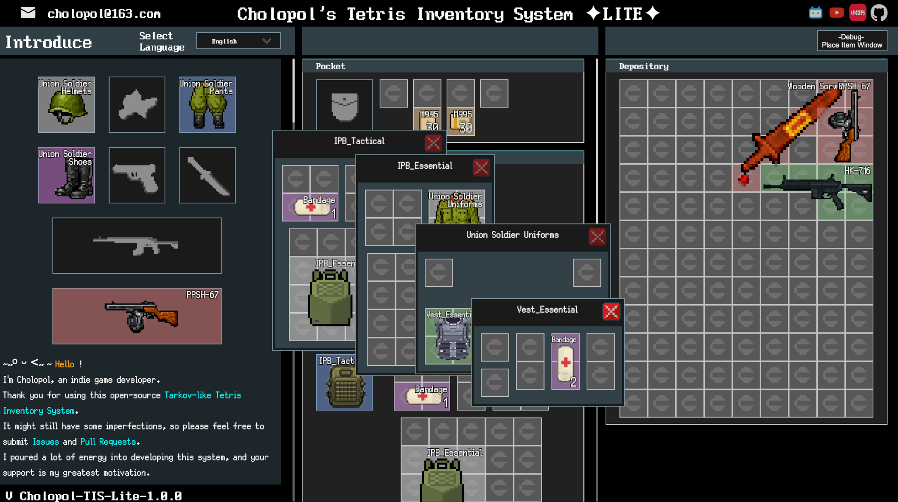

# **Cholopol's Tetris Inventory System**


[](https://cholopol.github.io/Cholopol-Tetris-Inventory-System/)
[](https://space.bilibili.com/88797367)


English | [中文](./README.md)


This is an advanced inventory management system built with Unity Engine 2022. It is developed with an MVVM (Model-View-ViewModel) architecture to deeply decouple data logic from UI presentation. It faithfully recreates the core experience of Escape from Tarkov, and supports irregular-shaped items, infinite nesting, and highly customizable extensibility.

## 📕Table of Contents

- [⭐Key Features](#core-features)
- [🚀Quick Start](#quick-start)
- [🎭Third-Party Dependencies](#third-party)
- [👨‍💻Core Components](#core-components)
- [👨‍💻Loxondon MVVM Architecture - Long Live Open Source](#loxodon-mvvm)
- [👨‍💻Tetris Coordinate System - The Art of Numbers](#tetris-coordinate-system)
- [👨‍💻SpriteMeshRaycastFilter - A Precise Tetris-Shape Interaction Filter](#sprite-mesh-raycast-filter)
- [👨‍💻Nested Inventory - GUID-Based Logical Dependencies and MVVM Perfection](#nested-inventory-guid)
- [👨‍💻InventoryTreeCache - The Navigator of TetrisItem](#inventory-tree-cache)
- [👨‍💻Highlight Tile System - Colorful Highlights to Customize Your Inventory](#highlight-system)
- [👨‍💻Customized Item Editor - A Few Clicks, and You Added an Item](#item-editor)
- [🤝 Contributing](#contributing)
- [🔧 Future Improvements](#future-improvements)
- [📜 License](#license)
- [📬 Contact](#contact)
- [☕ Buy Me a Coffee - ❤️Your Support Is My Biggest Motivation](#sponsor)

<a id="core-features"></a>
## ⭐Key Features

- 🧩 **Perfect Tetris tile design**: Supports item rotation and grid-based placement logic, with richer interactions and Tetris-shape-based operation filtering.
- 🏗️ **MVVM architecture**: The Item/Grid/Slot/Ghost system decouples View/ViewModel/Model logic.
- 💾 **Save system**: A powerful serialization system persists inventory state.
- 🛠️ **Custom editor**: Built-in UI Toolkit editor makes item creation easy.
- 🌍 **Localization**: Integrated multi-language support.



<a id="quick-start"></a>
## 🚀Quick Start

### Requirements

- Unity 2022.3.52f1 or newer.

### Import Steps

- Clone the repository:  

```json
git clone https://github.com/Cholopol/Cholopol-Tetris-Inventory-System.git
```

- Open the project in Unity Hub.
- Wait for Unity to import assets and dependency packages.

### Basic Usage Example

- Navigate to Assets/Scenes/.
- Open the EFT Like UI scene.
- Click Play.
- Controls

  - Press B: Open/close the inventory.
  - Press R: Rotate the item while dragging.
  - Left mouse button: Drag items.
  - Right mouse button: Open the item context menu.

<a id="third-party"></a>
## 🎭Third-Party Dependencies

In most cases, no manual installation is required. If you run into issues, refer to the following:

### Loxodon Framework

Loxodon Framework is an excellent open-source Unity MVVM framework that is easy to pick up. Repository: <https://github.com/vovgou/loxodon-framework.git>  
In this project it is installed by adding the following to Packages/manifest.json:  

```plaintext
{
  "dependencies": {
    // ...
    "com.unity.modules.xr": "1.0.0",
    "com.vovgou.loxodon-framework": "2.6.7"
  },
  "scopedRegistries": [
    {
      "name": "package.openupm.com",
      "url": "https://package.openupm.com",
      "scopes": [
        "com.vovgou"
      ]
    }
  ]
}

```

If you run into issues, see the official installation guide: <https://github.com/vovgou/loxodon-framework/blob/master/Installation.md>.

### Localization

Uses Unity's official Localization package, installed via Unity Package Manager: `com.unity.localization`.

### Newtonsoft-json

A high-performance JSON serialization tool, installed via Unity Package Manager: `com.unity.nuget.newtonsoft-json`.

<a id="core-components"></a>
## 👨‍💻Core Components

### 1\. MVVM Architecture Implementation

Instead of traditional MonoBehaviour strong coupling, this project uses a data-driven approach. Below are some examples.

#### ViewModel (TetrisGridVM, TetrisItemVM)

- This is the brain of the system. `TetrisGridVM.cs` maintains a 2D array `_tetrisItemOccupiedCells` to record grid occupancy. It performs pure logic and does not depend on any `UnityEngine.Object`.
- `TetrisItemVM.cs` handles item rotation state (`_rotated`), coordinates, and size data.

#### View (TetrisGridView, TetrisItemView)

- Responsible for rendering. They listen to ViewModel property changes (such as position changes and rotation changes) and automatically update the UI.

### 2\. Global Interaction Management

`InventoryManager.cs` is the commander (Singleton). It does not handle specific grid logic, but coordinates:

- **Input handling**: Listens for global keys in Update() (such as R to rotate, B to toggle the inventory).
- **Raycasting**: Uses GetGridViewUnderMouse() to determine which grid the mouse is hovering over in real time, and updates `selectedTetrisItemGridVM`.
- **Visual feedback**: Calls the `inventoryHighlight` component to render green (placeable) or red (conflict) highlight tiles in the UI based on the ViewModel result.

### 3\. Data Persistence System

The save system is driven by `InventorySaveLoadService.cs`:

- **Data separation**: All static item data (icons, names, shapes) is stored in `ItemDataList_SO`. Dynamic data (position, rotation state, container ID) is deserialized from JSON into `InventoryData_SO` for runtime caching and real-time inspection in the editor.
- **GUID mapping**: Each grid container and item has a unique GUID. The system rebuilds the ViewModel tree from GUIDs and notifies the View layer to generate the corresponding UI prefabs.

<a id="loxodon-mvvm"></a>
## 👨‍💻Loxondon MVVM Architecture - Long Live Open Source

### 1\. Model Layer

**Responsibility**: Defines the "shape" of data without business logic.

- **Static data**: Uses `ScriptableObject` to store game configuration.
- For example: the `ItemDetails` class defines an item's name, icon, and grid shape (Point Set), etc.
- **Runtime data**:
- `InventoryData_SO` stores runtime inventory data (item states, positions, etc.).
- `InventorySaveLoadService` acts as the data repository service, injecting Model data into the ViewModel.

### 2\. ViewModel Layer

**Responsibility**: Serves as a bridge between View and Model, holding the state needed by the View and handling logic.

- **Inheritance**: Inherits from ViewModelBase (Loxodon Framework).
- **Core mechanism**: Relies on Loxodon Framework data binding to control data flow, usually `View←ViewModel` or `View←→ViewModel`.
- **Property notification**: Uses `Set(ref _field, value)`. When a property value changes (for example, GridSizeWidth), it automatically notifies the bound View to update.
- **Logic encapsulation**:
  - `TetrisSlotVM`: Maintains slot occupancy and determines whether an item can be placed.
  - `TetrisGridVM`: Computes grid occupancy (`_tetrisItemOccupiedCells`) and determines whether an item can be placed.
  - `TetrisItemVM`: Manages an individual item's state (rotation direction `_dir`, coordinate `_localGridCoordinate`).

### 3\. View Layer

**Responsibility**: Visualizes the UI and converts user input into ViewModel commands.

- **Inheritance**: Inherits from UIView or a specific base class (such as TetrisItemContainerView&lt;TetrisGridVM&gt;).
- **Core mechanism**:
- **Data binding**: In TetrisGridView.cs you can see the following code:  

```plaintext
this.SetDataContext(_viewModel); // Set data context
// Then Loxodon automatically syncs VM properties to View components
```

- **Event listening**: The View listens to Unity events like OnPointerEnter and forwards them to the Manager, or directly calls VM methods.

### 🔄 Data Flow Example

Take "rotate item" as an example:

- **User action**: The player presses R.
- **Manager**: `InventoryManager.cs` captures the key and calls `RotateItemGhost()`.
- **ViewModel**: The code updates the `_rotated` property of `TetrisItemVM`.

```plaintext
// TetrisItemVM.cs
public bool Rotated { get => _rotated; set => Set(ref _rotated, value); }
```

- **Framework**: Loxodon detects the Rotated property change and triggers binding automatically.
- **View**: TetrisItemGhostView.cs receives the change notification and updates the RectTransform rotation.

<a id="tetris-coordinate-system"></a>
## 👨‍💻Tetris Coordinate System - The Art of Numbers

### 1\. Core Design Overview

The grid container design of this project is based on a classic Tetris (tetromino) variant, combined with MVVM architecture and a Cartesian coordinate system. The system discretizes continuous UI space into a 2D integer matrix to achieve precise item placement, rotation, and collision detection. Once again, it shows that human intelligence surpasses LLMs.

- Key class responsibilities

  - TetrisGridVM (ViewModel): Responsible for pure logic computation. Maintains a `TetrisItemVM[,]` 2D array as the "logical grid" to record which item occupies each cell.
  - TetrisGridView (View): Responsible for UI presentation. Converts the ViewModel logical coordinates into Unity UI (RectTransform) screen pixel coordinates.
  - TetrisUtilities: Provides low-level math utilities, especially rotation algorithms.

### 2\. Coordinate System and Mathematical Formulas

1\. Grid Coordinates

The system uses a coordinate system with the top-left corner as the origin (0,0) (commonly corresponding to a Top-Left anchor in UI layout).

- X axis: Increases to the right (Column Index)
- Y axis: Increases downward (Row Index)
Data structure:

```plaintext
// TetrisGridVM.cs
private TetrisItemVM[,] _tetrisItemOccupiedCells; // [width, height]
```

### 3\. Pixel Position Calculation Formula

The formula to convert logical grid coordinates $(x, y)$ into UI local coordinates $(P_x, P_y)$ is:

$$
P_x = x \times W_{unit}
$$
$$
P_y = - (y \times H_{unit})
$$

- $x, y$: Integer coordinates of the item in the grid (column, row).
- $W_{unit}, H_{unit}$: Pixel width/height of a single grid cell (typically `Settings.gridTileSizeWidth`, default 20f).
- Note: $P_y$ is negative because in Unity UI, positive Y points upward, while grid layouts often grow downward (similar to text flow).
Implementation reference:

```plaintext
// InventoryHighlight.cs (similar logic)
Vector2 tilePos = new Vector2(
    (point.x + ghost.RotationOffset.x) * tileW,
    -((point.y + ghost.RotationOffset.y) * tileH) // Negate Y
);
```

### 4\. Item Shapes and Rotation Algorithm

The occupied cells of an item are defined as a set of coordinates relative to the item origin $(0,0)$: `List<Vector2Int>`.

Rotation transform formula (90° clockwise):
For any point $(x, y)$ in the shape, the rotated coordinate $(x', y')$ is:

$$
x' = -y
$$
$$
y' = x
$$

Code implementation:

```plaintext
// TetrisUtilities.cs
public static List<Vector2Int> RotatePointsClockwise(List<Vector2Int> points)
{
    List<Vector2Int> rotatedPoints = new();
    foreach (var point in points)
    {
        rotatedPoints.Add(new Vector2Int(-point.y, point.x)); // Core rotation formula
    }
    return rotatedPoints;
}
```

Rotation offset correction (Pivot Offset):
Pure rotation can move the shape out of its original bounds (because rotation is around (0,0)). The system introduces RotationOffset to correct the post-rotation origin so the item remains aligned to the grid.

$$
Offset_{Up} = (Width - 1, Height - 1)
$$

Different directions have different hard-coded offsets. See `TetrisUtilities.cs:L66`.

### 5\. Logic Implementation Details

1\. Collision Detection

When placing an item, the system iterates through all occupied points $(p_x, p_y)$ and adds the base coordinate $(O_x, O_y)$:

$$
Target(x, y) = (O_x + p_x + Offset_x, O_y + p_y + Offset_y)
$$

Validation conditions:

1. Boundary check: $0 \le Target_x < GridWidth$ and $0 \le Target_y < GridHeight$
2. Occupancy check: _tetrisItemOccupiedCells[Target_x, Target_y] must be null.

2\. Placement
When validation passes, the item is "written" into the logical grid:

1. Mark all Target(x, y) coordinates in _tetrisItemOccupiedCells with the item's reference.
2. Update the View layer by computing RectTransform.anchoredPosition using the formula.

### 6\. Advantages and Highlights

1\. Mathematical Purity:

- Converts complex UI interactions into simple matrix operations.
- Rotation uses standard linear algebra transforms. Position computation is an affine transformation in graphics, ensuring logical rigor.

2\. MVVM Separation:

- Logic first: All collision, rotation, and position computations are done in the VM layer (pure C# classes) without relying on Unity Transform or Physics. This makes the logic highly efficient and easy to unit test.
- "Dumb" View layer: The View only sets positions based on VM results and does not participate in logic decisions.

3\. High Performance:

- O(1) lookup: Directly accesses any cell state via a 2D array without iteration.
- Zero GC: The highlight system uses object pooling, and coordinate computations are all struct-based (Vector2Int) to avoid heap allocations.

4\. Flexible shape definition:

- Shapes are not preset textures, but coordinate point sets. This makes it easy to create arbitrary irregular shapes (L, T, diagonals, even hollow shapes).

### 7\. Future Improvements

1\. Sparse matrix optimization:

- Currently uses a TetrisItemVM[,] 2D array. If the grid is very large (e.g., 1000x1000), memory usage increases significantly and contains many null references.
- Suggestion: For extremely large grid containers, consider using Dictionary<Vector2Int, TetrisItemVM> to store occupancy.

### 8\. In Summary

Linear algebra is the backbone of the Tetris coordinate system:

- Linear transforms handle rotation.
- Vector addition handles movement.
- Matrix operations project block coordinates into final screen pixels.

<a id="sprite-mesh-raycast-filter"></a>
## 👨‍💻SpriteMeshRaycastFilter - A Precise Tetris-Shape Interaction Filter

Its purpose is to make mouse clicks more precise: it only responds to the "real shape" area of the object and ignores transparent blank areas. In Unity (and most game engines), UI images are **rectangles** by default.
For example:

Imagine an "L" shaped Tetris block:

``` plaintext
🟥
🟥
🟥 🟥
```

But to the computer, it is wrapped in a transparent rectangular box:

``` plaintext
🟥 ⬜
🟥 ⬜  <-- The white ⬜ area is actually transparent, but in UI logic it belongs to this Object
🟥 🟥
```

Without this script:
When you click the blank area in the top-right corner (⬜), even though it looks like you clicked empty space (or an item behind it), the system would still treat it as clicking this "L" block. This leads to frequent misclicks: you want the item behind, but the transparent edge of the item in front blocks you.

**This script is like a precise "cutting knife". It tells Unity's raycast system (Raycaster):** "Only count it as hitting me when the mouse actually touches colored grid cells. If it's in a transparent cell, ignore me and let the click pass through."

This script is attached to the item UI and the item ghost UI. Whenever you move the mouse or click, it quickly performs three steps:
1. Locate: It checks where your mouse is within the current Image (top-left, bottom-right, etc.).
2. Lookup: It reads the item's "shape data" (L, T, square, etc.). It knows which cells are filled and which are empty.
   - Code reference: TryGetShapeConfig asks the ViewModel: "What shape are you?"
3. Decide:
   - If the grid cell under the mouse is filled -> block the click (return true, considered hit).
   - If the grid cell under the mouse is empty -> allow the click (return false, as if this object doesn't exist, so you can click things behind it).
   - Code reference: IsRaycastLocationValid is the core judge.

Why it matters:

- For experience: In inventory-management games, items are packed densely. Without "irregular click" support, picking up complex shapes feels frustrating and misclick-prone.
- For performance: The script includes optimizations (_cachedPoints). As long as the item hasn't rotated or changed shape, it doesn't need to recompute every time.

<a id="nested-inventory-guid"></a>
## 👨‍💻Nested Inventory - GUID-Based Logical Dependencies and MVVM Perfection

In Cholopol-Tetris-Inventory-System, nesting (for example: a backpack contains body armor, and the armor contains a bandage) and restoration are implemented via a combination of GUID indexing and InventoryTreeCache. This design avoids complex recursive object structures by flattening the data for storage and reconstructing it into a logical tree at runtime.

### GUID Chain References

Each "container" (such as pockets or backpack grids) and each "item" has a unique GUID:

- **Container**: Represented by ContainerNode, with a ContainerId.
- **Item**: Represented by ItemNode, with an ItemGuid.
- **Nesting relationship**:
  - Each item record (TetrisItemPersistentData) contains a containerGuid field pointing to its parent container.
  - If an item itself is a container (e.g., body armor), it will have its own grid group. Each grid ID is associated with the item's GUID and is maintained in a mapping by the cache manager.

### Data Reassembly Flow

When BuildRuntimeCache() is called, the system iterates all item records and builds indices in the cache.

- Flattened input: `InventoryData_SO` provides a list of all items: `List<TetrisItemPersistentData>`. Each item has itemGuid and containerGuid (pointing to its container).
- Build index (PlaceItem):
  - Iterate each item in the list.
  - Call `cache.PlaceItem(containerId, data)`.
  - Key action: The cache looks up or creates a ContainerNode (container node) and adds the item record to that node's list.
  - Result: The cache forms a `ContainerID -> List<Items>` mapping.

### Nested Restoration Mechanism

Restoration does not generate all UI at once. It is done lazily and recursively on demand.

- Step 1: Top-level container binding
  1. At Start or when opening the UI, the system first identifies persistent grids already present in the scene (e.g., the player's main backpack panel). It reads the GUID from the panel's DataGUID component (e.g., Depository_GUID).
  2. Call `TetrisGridFactory.BindViewToGuid(gridView, guid)`.
- Step 2: VM initialization and data fetching
  1. When `TetrisGridVM` is bound to a GUID, it runs `PrimeFromCache()` (data priming):
  2. Ask cache: The VM requests from `InventoryTreeCache`: "Give me all items under Depository_GUID."
  3. Get data: The cache returns `IEnumerable<TetrisItemPersistentData>`.
  4. Generate child items: The VM iterates the data and creates child TetrisItemVMs for each record.
- Step 3: Recursive handling
  1. If a generated child item is also a container (e.g., a "tactical chest rig"):
  2. Identify container: The child's `TetrisItemVM` is marked as having internal grids.
  3. Assign GUID: The child grid GUID is usually the item's itemGuid plus a hierarchy index, for example:

    ```json
    "persistentGridGuid": "ff3764e8-5a2e-43d4-9b4e-cafdc418ca84:3"
    ```

  4. Trigger recursion:
  - When the player opens this "tactical chest rig" UI, a new `TetrisGridView` is created.
  - The new View is bound to the child grid GUID above.
  - Repeat Step 2: The newly bound VM again asks the cache: "Give me the items inside ChestRig_GUID."
  - The cache returns items like magazines and grenades stored in the chest rig.

<a id="inventory-tree-cache"></a>
## 👨‍💻InventoryTreeCache - The Navigator of TetrisItem

`InventoryTreeCache` does not store the tree directly. It stores "relationships". This "lookup table" approach perfectly solves infinite nesting: no matter how deep the hierarchy is, it is just key-value lookups, without complex recursive traversal algorithms. The tree implementation uses a **"flattened storage + runtime relationship cache"** pattern, similar to relational database design. Below is a comparison with a traditional Unity inventory implementation:

1\. Core differences

| Feature | Traditional implementation | This project |
| --- | --- | --- |
| Data structure | Nested object references `class Bag { List<Item> items; }` | Flattened list + foreign key `class Item { string containerGuid; }` |
| Lookup | Recursive traversal: finding an item requires walking down from the root. | Hash index (O(1)): query container contents directly via InventoryTreeCache. |
| Serialization | Serialize the tree directly: sensitive to recursion depth, deeply nested JSON. | Serialize a list: flat JSON without nested levels, more compact. |
| UI generation | Prefab nesting: UI hierarchy often mirrors data hierarchy. | MVVM dynamic binding: UI is a projection of data; View is decoupled from data. |

2\. Advantages

- 💾 **Data safety and serialization robustness**
  - **Avoid circular references**: In traditional nested objects, if two items reference each other (e.g., placed into each other), the serializer crashes. The flattened GUID design fully avoids infinite recursion.
  - **Save/load efficiency**: Saving only dumps a list, without handling complex graphs.
- ⚡ **Extremely fast query performance**
  - With InventoryTreeCache.cs, looking up "what's in this backpack" is a dictionary lookup, O(1).
  - In contrast, finding a specific ID in a traditional tree can be an O(N) full-tree traversal.
- 🧩 **Flexible parent-child restructuring**
  - Moving an item (e.g., from backpack A to backpack B) only requires changing the item's containerGuid field, without complex in-memory operations like "remove from A list -> add to B list".
- 💤 **Lazy loading support**
  - The system can load only "item data" without generating all UI immediately. Only when the player opens a child backpack does it query InventoryTreeCache and generate the View. This is very friendly to large saves with many nested items.

3\. Disadvantages

- 🔧 **State synchronization complexity**
  - You must keep ViewModel (runtime state), InventoryTreeCache (cache), and persistent data (save data) consistent.
  - If a developer forgets to update the cache when moving items, logic can desync from data (e.g., UI shows the item in the backpack, but data thinks it's on the ground).
  - In code: `InventoryService.cs` contains dedicated sync methods for this.

4\. What makes it unique

- 🌟 **Mediator cache layer**  
    Most inventory systems either operate directly on UI (beginner) or directly on data (intermediate). Cholopol-Tetris-Inventory-System introduces InventoryTreeCache as a middle layer.
  - It doesn't care how the UI is displayed, nor how the data is stored.
  - It purely maintains the relationship topology of "who belongs to whom".  
    This design makes MVVM ViewModels very lightweight: VMs only request data from the cache instead of holding heavy lists.
- 🌟 **Truly decoupled architecture**  
    In traditional implementations, deleting an inventory UI often implies destroying the data objects inside. But in Cholopol-Tetris-Inventory-System:
  - **Destroying UI (View)**: only recycles the GameObject.
  - **Data (ViewModel/Model/Cache)**: remains intact in memory.  
    This means you can close the inventory panel at any time (recycling all UI back to the pool). When you open it again, it restores instantly from the cache while preserving the original state.

5\. In summary

The tree design of Cholopol-Tetris-Inventory-System adopts a "space for time" and "complexity for flexibility" trade-off. It sacrifices some code intuition (you need to understand GUIDs and caching) in exchange for excellent data stability and efficient retrieval. It is very suitable for games like Escape from Tarkov that have huge item counts and complex nesting.

<a id="highlight-system"></a>
## 👨‍💻Highlight Tile System - Colorful Highlights to Customize Your Inventory

The highlight tile system not only improves visuals, but is also a key part of user experience (UX) and performance optimization. Below are its core benefits and technical highlights:

### 1. MVVM-Driven "Ghost" Preview (Ghost Preview)

The system uses TetrisItemGhostView (ghost item) to simulate placement, instead of moving the real item object directly.

- **Benefit**: Decoupling and safety. While dragging, the real item data (Model) remains unchanged; only a visual "ghost" moves. Only when the player releases the mouse and placement is legal does it commit real data changes.
- **Highlight**: Real-time rotation preview. When the player presses R, the ghost item rotates its point set in memory. The highlight system immediately recalculates placeability based on the new shape, smoothly and without stutter.

### 2. Pooled High-Performance Rendering (Pooled Rendering)

The highlight system does not pre-create highlight tiles for every grid cell. Instead, it uses **object pooling**.

- **Code reference**: InventoryHighlight.cs  

```plaintext
GameObject tile = PoolManager.Instance.GetObject(highlightTilePrefab);
```

- **Benefit**: Zero GC pressure. No matter how complex the item shape is, the system only pulls a limited number of UI objects from the pool. When the highlight disappears, these objects are immediately returned (PushObject) instead of destroyed. This is critical for performance in frequent Update loops.

### 3. Context-Aware Validation (Context-Aware Validation)

Highlight colors are not just simple "green" or "red". They are determined by a powerful context structure: InventoryPlacementContext.

- **Code reference**: InventoryPlacementContext
- **Benefit**: Extensible validation logic. The system packages all current operation context (item, target container, rotation state, anchor position):
- **Green**: Free space, fully legal.
- **Red**: Occupied or out of bounds.
- **Yellow**: Can be stacked/merged.
- **Cyan**: For example, quick swap: if a target cell is occupied but meets swap rules, it highlights cyan to indicate releasing will swap.

### 4. Data-Driven Configuration (Configurable Palette)

Highlight colors are not hard-coded. They are configured via a ScriptableObject (InventoryPlacementConfig_SO).

- **Benefit**: Designer-friendly. Designers can tweak ValidColor and InvalidColor RGBA values and transparency directly in the Unity editor, and can even configure different highlight strategies (e.g., color-blind mode) without changing any code.


- **Logic layer** (TetrisGridVM): Responsible for fast math computations (occupancy detection).
- **Presentation layer** (InventoryHighlight): Efficient rendering via pooling.
- **Data layer** (PlacementConfig): Flexible visual configuration.

This design ensures that even on low-end devices, dragging remains silky smooth regardless of inventory size or item shape complexity.

<a id="item-editor"></a>
## 👨‍💻Customized Item Editor - A Few Clicks, and You Added an Item

- In the Unity Editor menu bar, open **ChosTIS-> Item Editor**.
- Click `+` to create a new item data entry, which will automatically be added to `ItemDataList_SO`.
- Specify the sprite and grid shape information.
- For backpack-type items, you must manually assign the `GridUIPrefab` grid group prefab.

<a id="contributing"></a>
## 🤝 Contributing

Bug reports and feature requests are welcome! Please follow these steps:

- **Code style**:
  - Classes and methods: PascalCase
  - Variables: camelCase
  - All public methods must include XML documentation.

<a id="future-improvements"></a>
## 🔧 Future Improvements

**V 1.0.0**: 

1\. There is a known defect in the quick swap algorithm. During real testing, you may find that swapping fails when an item is in a certain state/direction. I will optimize this part of the algorithm in the future.

2\. Dragging may trigger `ArgumentException: Mesh can not have more than 65000 vertices` Error: unityEngine.UI.Text When generating the mesh, the number of vertices exceeds the upper limit of 65000, so VertexHelper. FillMesh directly throws an exception, and `InventoryTreeCacheMonitor. cs` will output the cache tree monitoring information, which will spell the cache content into many lines, and then outputText. text=_sb. ToString(); Continuous refresh (default maxLines=200). In the scenario, the default is to add rich text to this outputText, resulting in more characters. It is easy to cross the boundary when the number of items is high and drag triggers frequent reconstruction. This script is used to monitor cache information in real-time development, without affecting the normal use of the inventory system. You can turn it off.

<a id="license"></a>
## 📜 License

- This project uses the Apache License 2.0. See the [LICENSE](LICENSE) file for more information.
- Your project must include the [NOTICE](NOTICE) file.
- If necessary, your project should create a dedicated `THIRD-PARTY-NOTICES` file.
- Based on Section 4(b), the copyright notices in this system's source code must not be removed in commercial projects. If modified, you must indicate the modification location and time. For example:

```plaintext
Modified by [Your Name] [Year]:
 [Brief description of changes]
```

- **It is strictly forbidden to use this project for any form of plagiarism, piracy profit, or similar behavior. The author will pursue responsibility for such cases. Open-source spirit should be respected by everyone. You are welcome to submit infringement leads to `鹿卜Cholopol`.**

<a id="contact"></a>
## 📬 Contact

If you have any questions, suggestions, or ideas, feel free to contact me:

- 📧 Email: `cholopol@163.com`
- 💬 Community discussion: Coming soon
- 🌐 Video introduction: Coming soon

<a id="sponsor"></a>

## ☕ Buy Me a Coffee - ❤️Your Support Is My Biggest Motivation

<div align="center">
  <table>
    <tr>
      <th>Alipay</th>
      <th>WeChat Pay</th>
    </tr>
    <tr>
      <td></td>
      <td></td>
    </tr>
  </table>
</div>

---

<div align="center">

  

  **Copyright (c) 2026 Cholopol. All rights reserved.**

</div>
